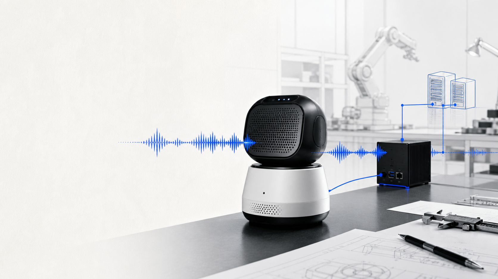
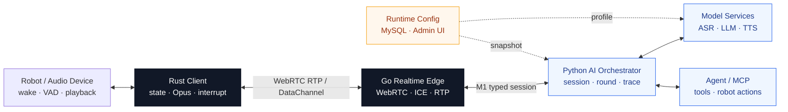

<p align="center">
  
</p>

<h1 align="center">AI Voice</h1>

<p align="center">
  面向机器人的端云协同实时语音 Agent 系统<br>
  <sub>听得见 · 听得准 · 停得住 · 做得到</sub>
</p>

<p align="center">
  
  
  
</p>

<p align="center">
  <a href="#这是什么">项目概览</a> ·
  <a href="#系统如何工作">系统架构</a> ·
  <a href="#快速上手">快速上手</a> ·
  <a href="docs/README.md">文档中心</a> ·
  <a href="docs/operations-reference.md">运维手册</a>
</p>

> [!IMPORTANT]
> 当前主线基于 `develop/v4.0`（`b820912d`），作为 4.0 交接版本。详见 [交接说明](docs/v4-main-handoff.md)。
> 代码合入、静态检查或单元测试通过，不等于线上部署或实体机验收。

## 这是什么

仓库名 `dify_stream_test` 来自早期实验阶段；现在它已经演进为一套完整的机器人实时语音平台：
端侧负责唤醒、采音、播放与打断，实时边缘网关负责 WebRTC 媒体传输，云端编排层串联
ASR、LLM、Agent、MCP 与 TTS，运行态配置则由 MySQL 和 Admin UI 统一管理。

| 核心能力 | 系统提供什么 |
| --- | --- |
| 实时对话 | WebRTC 双向音频、VAD、流式 LLM → TTS、自然打断 |
| 智能编排 | 普通对话、Agent、可选多步任务、MCP 工具与机器人动作 |
| 多模态 | 设备图像按需进入当前请求，不污染语音 RTP 与会话历史 |
| 运行治理 | Bot / Robot / MCP / Agent / TTS Profile 运行态配置 |
| 可观测性 | `trace_id` 到 `playback_id` 的跨层关联、状态与时延追踪 |
| 可部署性 | Rust 端侧、Go 实时网关、Python 服务、分层 Compose 与回滚基线 |

这个系统解决的不只是“语音转文字再回答”，而是一次真实交互中的四个连续问题：

```text
听清用户  →  理解意图  →  调用能力  →  及时、正确地播出来
  ASR          LLM          MCP              TTS
```

## 系统如何工作



### 一次语音请求

1. 设备唤醒后，Rust Client 开始 VAD、Opus 编码和 WebRTC 上行。
2. Go Gateway 处理 ICE / RTP / DataChannel，并把完整 utterance 交给 Python。
3. Python 依次调用 ASR、LLM / Agent / MCP，并把 LLM 增量文本持续提交给 TTS。
4. TTS 音频经 Python → Go → WebRTC RTP 回到 Rust 播放。
5. 打断、迟到音频和旧工具结果由 session / round / playback 状态共同隔离。

完整生命周期见 [架构与设计](docs/architecture-and-design.md)；Go-Python 边界见
[M1 内部语音协议](docs/go-python-internal-protocol-v1.md)。

## 为什么这样设计

| 原则 | 设计选择 | 价值 |
| --- | --- | --- |
| 快，来自减少等待 | LLM 增量文本直接进入 TTS | 让生成与合成重叠，不等待完整段落 |
| 稳，来自状态对齐 | session / utterance / round / playback 分层 | 拒绝迟到事件，避免旧音频串轮 |
| 实时与业务分治 | Go 管媒体，Python 管 AI 编排 | 网络热路径与业务演化互不侵入 |
| 动作必须显式 | 机器人能力通过 MCP / MQTT 工具调用 | 对物理动作保留清晰安全边界 |
| 配置以运行态为准 | MySQL Snapshot + Admin Apply / Reload | 多 Bot、多 Robot 能力可配置、可追踪 |
| 回滚必须可控 | M1 为主，M0 仅显式回滚 | 已提交轮次不跨协议自动重放 |

架构取舍及不可回退约束记录在 [设计决策](docs/decisions.md)。

## 代码地图

```text
rust_client/          端侧状态机、唤醒、VAD、WebRTC、播放与打断
go_voice_gateway/     实时边缘接入、ICE / RTP、M1 bridge、downlink gate
gateway/              Python 会话与 ASR → LLM → MCP → TTS 编排
stt/ llm/ tts/        独立模型服务与 provider adapter
mcp_servers/          工具服务、机器人控制与外部能力
server_config/        MySQL 配置、Runtime Snapshot 与 secrets
admin-ui/             运行态配置与观测后台
deploy/               业务层、模型层、Go Gateway 与 MCP 部署定义
test/                 pytest 测试根目录
docs/                 架构、协议、运维、验证与决策文档
```

## 快速上手

| 时间 | 目标 | 建议动作 |
| --- | --- | --- |
| 15 分钟 | 建立系统全貌 | 阅读本页与 [项目上下文](docs/project-context-for-ai.md) |
| 30 分钟 | 找到负责模块 | 按 [新人上手指南](docs/getting-started.md) 走一次请求链与代码地图 |
| 60 分钟 | 完成第一次安全验证 | 运行离线预检，再执行所改模块的最小定向测试 |

如果这是第一次接触仓库，直接从 [新人上手指南](docs/getting-started.md) 开始；它包含角色入口、
首次成功标准、真实链路检查、故障分流和第一次提交清单。

### 1. 先确认运行上下文

不要从 example 文件猜测当前环境，也不要覆盖已有 `.env`：

```bash
python scripts/ai_preflight.py --profile offline
```

需要本地、Compose、LAN、硬件或模型服务器时，再选择对应 Profile。预检只确认前提，
不会启动服务，也不代表链路验证通过。详见 [AI 运行环境](docs/ai-runtime-environment.md)。

### 2. 选择你的入口

| 目标 | 从这里开始 |
| --- | --- |
| 第一次加入项目 | [新人上手指南](docs/getting-started.md) |
| 第一次理解系统 | [项目上下文](docs/project-context-for-ai.md) → [架构与设计](docs/architecture-and-design.md) |
| 启动当前主线 | [START.md](START.md) |
| 使用 V4 拆分服务 | [V4 Compose](docs/docker-compose-v4.md) |
| 配置 / 排障 / 运维 | [Operations Reference](docs/operations-reference.md) |
| 修改 Go Gateway | [Go Voice Gateway](docs/go-voice-gateway.md) |
| 修改 Rust Client | [Rust Client README](rust_client/README.md) |
| 准备发布与回滚 | [部署检查](docs/deployment-checklist.md) → [版本管理](docs/version-management.md) |

### 3. 推荐的 V4 测试主线

```bash
make compose-network
make compose-v4-config
make compose-v4-up
make compose-go-up
```

这些命令依赖当前机器已经准备好的真实配置。模型层、Admin、MCP、开发挂载和停止方式见
[START.md](START.md)，不要把本段当成完整部署手册。

## 当前状态与证据边界

| 等级 | 可以说明什么 | 不可以外推为什么 |
| --- | --- | --- |
| `IMPLEMENTED` | 代码、静态检查或单元测试通过 | 没有真实服务或设备证据 |
| `LOCAL_VERIFIED` | 本机真实进程 / 协议集成通过 | 仍不是线上、外部依赖或硬件结果 |
| `LIVE_VERIFIED` | 授权的非本地服务链路及 Runtime Snapshot 通过 | 仍不代表物理设备体验 |
| `HARDWARE_VERIFIED` | 真实服务和实体设备共同通过 | 必须绑定日志、哈希与运行态证据 |

当前进展、已知限制和未完成项以 [Gateway 任务追踪](docs/voice_gateway_task_tracker.md) 为准；
证据格式与升级规则见 [Evidence Gates](docs/evidence-gates.md)。

> [!CAUTION]
> Bot、Robot、MCP、Agent 与 TTS Profile 以 MySQL `server-config` Runtime Snapshot 为准。
> `.env.example`、bootstrap YAML、测试 fixture 和历史报告都不能证明当前运行态。

## 开发与验证

按改动范围选择相关测试。以下是可选的检查工具，不是 AI 修改代码的前置流程：

```bash
# 轻量检查
python scripts/ai_quality_gate.py --mode quick

# 仓库卫生
python scripts/check_repo_hygiene.py

# 发布前
python scripts/ai_quality_gate.py --mode release
```

真实服务、MQTT、音频设备和硬件验证需要单独授权；mock、localhost、synthetic 或文件回放
不能升级为生产 E2E 结论。日常只需说明改动、已执行检查和未验证范围，无固定回复格式。

## 文档中心

所有文档的当前 / 历史边界由 [docs/README.md](docs/README.md) 维护。常用入口：

- [系统架构](docs/architecture-and-design.md) · [M1 协议](docs/go-python-internal-protocol-v1.md) · [自然打断](docs/natural-barge-in-v1.md)
- [部署运维](docs/operations-reference.md) · [上线清单](docs/deployment-checklist.md) · [版本与回滚](docs/version-management.md)
- [运行环境](docs/ai-runtime-environment.md) · [证据等级](docs/evidence-gates.md) · [日志规范](docs/logging.md)
- [安全说明](SECURITY.md) · [仓库卫生](docs/repository-hygiene.md) · [评测约束](docs/evaluation/README.md)

---

<p align="center">
  <strong>实时体验不是某一个模型的结果，而是设备、网络、状态、模型与播放共同完成的系统工程。</strong>
</p>
