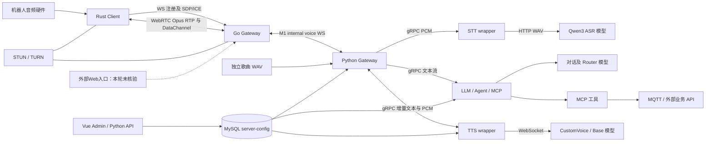

# AI Voice 项目技术交接说明

9月14日补充：[WebRTC网络迁移与机器人运维](WEBRTC_NETWORK_HANDOVER.md)。新WS入口、新旧隧道、机器人服务路径及Go探针修复以该说明为准；原9月11日采样仍是历史证据，数据库/模型/Admin未在本次重新核验。

## 1. 文档信息

| 项目 | 内容 |
|---|---|
| 项目名称 | AI Voice / ai-voice-realtime；部分历史文档称 dify_stream_test |
| GitLab / remote origin | http://10.10.52.100/robot/peiban/ai-voice-realtime |
| 当前 branch / HEAD | main / `993196661f0d71aed604ebdac587a7001a7e5097` |
| 远端 develop/v4.0 | `b820912d17208426893ca7d9e6cb884a9624dad0` |
| 历史分支 | release/v2.0=`529aca4c07c67fc0436c81d9e0e38aaf2d0ae236`；release/v3.0=`b89959818cd17b601bf1058f721594a686774182` |
| tag | 本次 `git ls-remote --heads --tags origin` 与本地 `git tag` 未发现 tag；旧文档提到的 v3.0.0 不代表目标 GitLab 已有该 tag |
| 生成日期 | 2026-09-11，Asia/Shanghai |
| 技术负责人 | 当前交接方；正式姓名/职责登记见待补充清单 |
| 接收人 / 交接日期 | 【待人工补充】M03 |

近期关键提交：`9931966` 保留目标仓库初始化历史并合入交接树；`48195d6` 整理 V4 交接和可选 AI 工作流程；`b820912` 新人学习路径；`41d4c4f` 唤醒回复回归；`613d747` 唤醒回复终态恢复；`f3600a2` M1 候选重试测试。提交存在不等于对应功能已正式验收。

分析范围为 641 个 Git 跟踪文件的目录/清单发现，主要业务源码、协议、配置、部署、测试、文档及历史配置抽查。不是逐行审计全部生成代码，也不是全 Git 历史漏洞审计。真实服务器证据与源码事实分别标明，详见 [服务器交接](SERVER_SERVICE_HANDOVER.md)。

## 2. 项目概述

项目是端云协同语音平台。Rust 端负责音频采播、唤醒、VAD 与交互状态；Go 负责 WebRTC 实时传输；Python Gateway 编排 ASR、LLM、TTS；MySQL 和 Admin UI 管理 Bot、Robot、Agent、MCP、TTS Profile。用途包括机器人语音对话、工具调用、预生成歌曲播放和图片场景问答。

交接方确认当前GitLab仓库功能均已交付，无已知业务遗留问题；实际客户端为陪伴机器人本体上的Rust版本。代码同时保留串口唤醒、TCP音频前端、自然打断、Turn Gate、复杂工作流等路径，路径存在或旧文档的实验标签不能替代当前设备配置。Base与业务容器已核验，机器人程序位于 `/home/windaka/Desktop/wzk/rust_client`，由windaka用户的 `robot_rust.service` 管理；9月14日资料已补齐M02。

## 3. 系统总体架构



音频上行通过 RTP；注册与 SDP/ICE 走 WS；DataChannel 承载开始/结束/打断/播放回报，另有 vision-v1 图片通道。Python 不承担现场 WebRTC 媒体终止。下行 TTS PCM 由 Python/Go 封装、编码与分包后通过 RTP 返回 Rust；业务工具调用不等于机器人动作已完成。

源码同时保留 M0 `/ws` 和 M1 `/internal/voice/ws`。当前源码 M1 控制会话默认启用，但 input_audio 默认 disabled/shadow；现场 Go status 已确认 input_audio active、interrupt/playback_report 开启。不能直接用仓库默认解释当前二进制行为。M1 已提交请求后不应盲目回退重放；见 `go_voice_gateway/asr_runtime.go` 的 `RequestCommitted` 判断。

## 4. 仓库目录结构

| 目录/文件 | 职责及重要入口 | 关系 |
|---|---|---|
| rust_client/ | src/main.rs、app.rs、config.rs、transport/webrtc.rs | 设备采播与 Go 建链 |
| go_voice_gateway/ | main.go、server.go、config.go、asr_runtime.go、internal_voice_client.go | Pion WebRTC 与 Python 桥接 |
| gateway/ | gateway_server.py、asr_pipeline.py、audio_protocol.py、internal_voice_protocol.py | 会话、鉴权、编排、取消、trace |
| stt/ | stt_grpc_server.py、asr_providers.py、stt_service.proto | PCM→Qwen ASR |
| llm/ | llm_grpc_server.py、llm_client.py、tool_router.py、agent_runtime.py、agents/ | Bot 对话、路由、Agent、MCP |
| tts/ | tts_grpc_server.py、audio_resampler.py、tts_service.proto | 增量文本→PCM |
| server_config/ | repository.py、snapshot.py、mysql_db.py、models.py | 运行配置及快照 |
| admin-ui/ | backend/app.py、auth.py、frontend/src/views/ | 配置管理、Apply/Reload、trace 查看 |
| mcp_servers/ | robot_sse_server.py、utils_sse_server.py、singing_sse_server.py | 本地工具入口，亦支持库中远程工具 |
| singing/ | catalog.json、voices.json、README.md | 歌曲/音色映射；WAV 独立移交 |
| turn-gate/ | configs/、models/model-lock.json、scripts/ | SmartTurn/EOU 及联合实验与权重校验 |
| esp32-s3-usb-aec/ | main/、components/、docs/BUILD.md | 独立 ESP-IDF USB 音频前端路线 |
| deploy/、docker/ | compose/、vllm/、go-gateway/、mysql-server/、Python Dockerfile | 仓库部署方案；不是完整现场镜像 |
| scripts/ | nohup_service.sh、init_config_db.py、migrations/、smoke/benchmark/eval | 运维、初始化、测量、可选 Harness |
| test/、data/eval_gold/、tools/ | pytest、Gold、STUN/WebRTC 探针 | 测试与测量，不作为自动验收结论 |
| docs/ | START 对应运维、架构、历史 tracker、硬件矩阵 | 注意区分旧机器路径与当前环境 |
| .github/workflows/ci.yml | Python/Go/Rust/Admin 检查 | 当前未发现 .gitlab-ci.yml |

发现阶段亦检查了 Makefile、shell、Dockerfile、Compose、requirements、Go modules、Cargo、Node manifests、env example、protobuf、API、日志、TODO/FIXME/deprecated。当前仓库未找到独立 Nginx/coturn/FRP 完整运维包或 systemd unit；Base 的 FRP 配置存在于仓库外部署目录。

## 5. 核心模块说明

| 模块 | 输入→输出 | 依赖/配置 | 核心行为 |
|---|---|---|---|
| Rust Client | 麦克风 PCM/唤醒→Opus RTP；下行音频→扬声器 | CPAL、Opus、Tokio、native-webrtc、串口；GATEWAY_URL/ROBOT_ID/ROBOT_SECRET | app.rs 状态机和 playback generation 隔离迟到音频 |
| Go Gateway | WS/RTP/DC→M1；Python 音频→RTP | Go 1.24/Pion；GO_VOICE_GATEWAY_* | server.go 注册、ICE、RTP；asr_runtime.go 桥接；downlink_rtp.go 下行门控 |
| Python Gateway | Opus/PCM/控制→ASR→LLM→TTS→音频 | FastAPI、grpc、opuslib、MySQL；gateway/config.py | authoritative Robot/Bot、interrupt cancel、round/playback、trace |
| STT | PCM16 mono→文本与耗时 metadata | QWEN_ASR_*；OpenAI compatible ASR HTTP | RecognizeSpeech 实现只收 pcm；StreamRecognize 收齐后识别 |
| LLM | 文本/会话/Bot→增量文本、metrics | LLM_*、Router、DB Snapshot、MCP | 普通对话/Agent/工具受 Bot 绑定约束；history/Agent 状态在内存 |
| TTS | 增量文本和 tts_profile_id→16k mono PCM16 | QWEN3_TTS_CUSTOM_VOICE_* / BASE_*；DB Profile | 双向 gRPC；上游 WS；Base 引用音频须模型容器可见 |
| Admin | 配置表单→DB 快照；Reload→多个服务 | Flask backend、Vue/Vite、ADMIN_* | 保存和生效是两个步骤；跨服务 Reload 无原子事务 |
| Robot/MCP | 工具参数→MQTT/HTTP/歌曲控制 | DB 工具绑定、ROBOT_MQTT_*、外部 API | MQTT publish 成功不能证明设备动作完成 |

Web 管理界面包含于本仓库，独立“Web AI Voice”业务前端未在此发现可确认的交付子项目。机器人其他控制程序、MQTT 服务、远程任务服务、外部 WebSearch、模型权重和音频资源不随本 Git 树完整交付（M01/M02/M06）。

交接方于2026-09-14明确：Vision图片生产、本机5200角度接口及实际音频硬件由硬件人员负责；Rust消费这些硬件侧输入/服务，源码及相关资料由GitLab的rust_client/和对应文档交付。这些配套职责不列为交接方未完成事项；设备binary与具体commit的匹配不因资料位置已明确而自动视为完成验证。

## 6. 一次完整语音请求的生命周期

1. Rust 从配置选择采播与唤醒来源，进入 WaitingForWakeWord/AwakeIdle/Recording 等状态。硬件 AEC/NS/AGC/KWS 的实际型号和参数须现场确认，不能以 ESP32/TCP 实验代替。
2. `/ws` 注册关联 robot_id、bot_id、session_id；交换 rtc_offer/rtc_answer、ICE candidate，建立 WebRTC。密钥仅来自设备配置。
3. 客户端内部音频为 16 kHz；VAD/交互状态触发 audio_start/audio_end。Opus 经 RTP 上传，Go `OnTrack→ReadRTP` 聚合 utterance；Turn Gate 可参与结束判断。
4. 现场 M1 发送 session.open、input_audio.start/batch/end 等消息。M0 `/ws` 留作显式兼容路径；需逐项看运行态，不能只看 M1 连接建立。
5. Python 校验 VAF1/OPUSRAW1，解码为 PCM；`gateway/asr_pipeline.py` 调 unary `RecognizeSpeech`，默认 deadline 15 秒。STT wrapper 内存封装 WAV，访问 Qwen ASR HTTP。
6. 空文本或被 interrupt 的结果不进入正常 LLM 回答；有效文本进入 `process_llm_tts_stream`。沿链传递 trace/session/round/playback 上下文。
7. LLM 按 Bot Snapshot 选择模型、Agent 和可用工具，返回增量文本。Python 将增量文本提交 TTS；不应恢复已取消的轮次或把服务端 done 当播放完毕。
8. TTS 按 Profile 连接 CustomVoice/Base WS，返回 PCM16 mono 16 kHz；Python/Go 完成音频封装和 RTP 下行，Rust 缓冲、播放并过滤过期 generation。
9. Rust 实际播放完成后发送 playback report；打断同时影响客户端播放与服务器 RPC/轮次。日志应将 trace_id、round_id、playback_id 关联起来。

| 契约 | 可确认格式/位置 |
|---|---|
| PCM | 内部/ASR/TTS：16 kHz、单声道、16 bit；stt/tts proto 和实现 |
| RTP | Go SDP/运行态 Opus clock 48000、mono、ptime 20 ms；RTP 时钟不同于 PCM 采样率 |
| VAF1 | `VAF1` + 4 字节大端 JSON header 长度 + JSON header + payload；header version=1；gateway/audio_protocol.py |
| Opus 聚合 | `OPUSRAW1` + 重复的 2 字节大端 packet 长度及 packet；gateway/opus_audio.py |
| M1 envelope | version/type/session_id/timestamp_ms/payload；可含 trace_id/utterance_id/round_id/playback_id；gateway/internal_voice_protocol.py |
| M1 batch | event_type=input_audio.batch、direction=uplink、encoding=opus；session 和长度/packet_count 必须匹配 |
| RPC | stt/stt_service.proto；llm/llm_service.proto 与 workflow_service.proto；tts/tts_service.proto |

session_id 是会话，trace_id 是业务轮次跟踪，utterance_id 是输入语句；round_id/playback_id 是响应/播放归属。Gateway 默认 PCM 输入限制为 400000 bytes / 10000 ms（gateway/config.py），超长请求按真实校验结果处理。

## 7. 配置系统

| 来源 | 内容/默认/优先级 | 获取/生效 |
|---|---|---|
| 根 config.py、gateway/config.py | 进程 env 优先于根 .env；仅去引号，不展开 `${VAR}` | .env 由交接方移交；运行进程不会自动读修改后的文件 |
| MySQL server-config | Bot/Robot/MCP/Agent/TTS Profile、快照 | Admin 授权账号或受控数据库访问；不能用旧 YAML 代替 |
| server_config/bootstrap/legacy_*.yaml | 初始化输入 | init_config_db 会写库、同步/删除旧绑定；不得作为只读检查执行 |
| Go config.go | GO_VOICE_GATEWAY_ADDR 默认127.0.0.1:8282；M0/M1/ICE/UDP/Turn Gate | 部署 Compose env、现有 binary --print-config；现场优先看 /internal/status |
| Rust config.rs | GATEWAY_URL 优先分项；webrtc_only、rtp_only、fallback=false | 设备 env 与现有 binary --print-config/--print-env-help |
| ASR | QWEN_ASR_* 优先旧 ASR_*；provider=qwen；模型默认 qwen-asr | 现场模型名见服务器文档 |
| LLM | LLM_BASE_URL/API_KEY/MODEL_NAME、LLM_ROUTER_* | 请求非空 model/非零参数可覆盖 Bot；temperature=0 不作为覆盖值 |
| TTS | QWEN3_TTS_CUSTOM_VOICE_WS_URL/API_KEY/MODEL、QWEN3_TTS_BASE_* | Profile provider_config + endpoint env；不能沿用旧 key 名推断 |
| Admin | ADMIN_USERNAME/PASSWORD/SESSION_SECRET、内部服务地址 | 账号由交接方分配；API 保存后 Apply/Reload |
| 设备/网络/工具 | ROBOT_SECRET、ICE TURN 凭据、MQTT 密码、MCP headers、外部 API key | 现有密钥配置/管理员；只交接引用、权限和获取渠道 |

Gateway 默认 gRPC 为 127.0.0.1:50054/50053/50052；Compose 拆容器时需服务 DNS，不能复制 localhost。LLM/TTS 无 DB 或首次加载失败会启动失败。`build_gateway_settings` / `build_tts_settings` 对 service_configs 的读取不完整（server_config/snapshot.py），表单保存不保证所有字段生效。

Admin Apply 先 validate 再并行 reload，局部失败可能产生版本差异；失败服务保留旧状态。现场 Gateway/LLM/TTS=207，DB 最新=208，未替用户 Reload。快照仅留最近 10 份，不能代替数据库备份。统一待确认 M05。

## 8. 开发环境

| 栈 | 仓库证据 | 现场/限制 |
|---|---|---|
| Python | docker/python-services.Dockerfile 使用3.11-slim；requirements.txt/requirements-turn-gate.txt | 业务实际3.12.3虚拟环境；多数依赖未锁，精确版本见服务器文档 |
| Go | go_voice_gateway/go.mod：1.24.0；Pion webrtc/v4 | Base 未找到 go 命令；不能依赖现场编译恢复 |
| Rust | edition 2021；Cargo.lock；native-webrtc 非默认 feature | rustc/机器人 binary 尚待核验；使用正确 feature |
| Node | admin-ui/frontend/package.json：>=20.19.0；Vue3/TS/Vite | package-lock 与 pnpm-lock 均存在；CI 使用 npm ci |
| 原生音频库 | Dockerfile：ffmpeg、libopus0/dev、portaudio19-dev、build-essential | Linux Rust CPAL 另需目标系统 ALSA/udev 依赖，按 rust_client 文档 |
| CUDA/GPU | vLLM/Omni 模型部署定义 | Base NVIDIA driver535.146.02，8×A6000；驱动显示的 CUDA 上限不等于 toolkit 版本 |
| ESP32 | ESP-IDF ~5.5.3、dependencies.lock、本地 usb_device_uac_fork | 独立硬件路线；不在本次构建/刷写 |

## 9. 本地启动方法

以下为源码入口整理，**【待人工验证】未在本机安装依赖或运行完整链路**。仅在独立开发环境操作，已有现场配置不得被示例覆盖。

```bash
git clone http://10.10.52.100/robot/peiban/ai-voice-realtime.git
cd ai-voice-realtime
python3.11 -m venv .venv
. .venv/bin/activate
python -m pip install -r requirements.txt
# 需要 Turn Gate 模型时再安装 requirements-turn-gate.txt
test -e .env || cp .env.example .env
```

随后填入开发 DB、模型、设备和 ICE 配置。已有数据库先核迁移记录；新建开发库才使用 `scripts/init_config_db.py`，该脚本自身不会自动加载根 .env，应显式提供 CONFIG_DATABASE_URL。初始化包含实际写入，不在本次交接检查中执行。

模型端点与 DB 可用后，在不同终端、同一虚拟环境运行：

```bash
python stt/stt_grpc_server.py
python llm/llm_grpc_server.py
python tts/tts_grpc_server.py
python gateway/gateway_server.py
```

另开终端在 go_voice_gateway 下 `go run .`，按需要设置监听、Python URL 和 ICE。同机同时运行Admin时，将Go监听设置为 `GO_VOICE_GATEWAY_ADDR=0.0.0.0:15010`，避免与Admin新默认8282冲突，并同步Rust连接端口。设备端使用：

```bash
cd rust_client
GATEWAY_URL=ws://<网关地址>:<端口>/ws \
ROBOT_ID=<已登记设备ID> ROBOT_SECRET="$ROBOT_SECRET" \
TRANSPORT_POLICY=webrtc_only WEBRTC_ENABLED=true \
TRANSPORT_FALLBACK_ENABLED=false WEBRTC_OFFER_FACTORY=native \
RTC_AUDIO_UPLINK=rtp_only \
cargo run --bin rust_client --features native-webrtc --release
```

上述占位符替换后执行；构建只用于新开发环境，不能直接替换现场程序。Admin：根目录 `python admin-ui/backend/app.py`，默认监听 `0.0.0.0:8282`；前端目录 `npm ci` 后 `npm run dev`，代理指向8282。现场部署后通过 `http://10.10.6.121:15282` 内网访问，无需Admin FRPC。实体音频/串口权限与设备型号仍需 M02。

## 10. 服务部署

**本次保留现场 Base + 业务容器 + nohup/Compose 混合方式，不做改造。** 准确现场命令和目录见 [服务器交接](SERVER_SERVICE_HANDOVER.md)。

仓库另提供 V4 分服务 Compose（docker-compose.v4.yml/dev.yml）、V3 兼容入口（docker-compose.v3.yml）、deploy/compose/business.yml、go-gateway.host.yml、mcp.yml 和 deploy/vllm/docker-compose.models.yml。这些是可选部署方案，不代表现场采用整套 V4 Compose。`make models-up`、部分业务 up 目标包含 build，交接盘点不要执行。

已有库迁移位于 scripts/migrations：Agent、TTS Profile、max_response_chars，以及若干会修改模型和工具默认绑定的 SQL。不能为了“补齐版本”把所有 SQL 盲跑；现场已只读确认 max_response_chars 列存在，未确认全部历史迁移执行顺序。恢复材料见 M05/M06。

## 11. 模型服务

| 能力 | 本次现场启动模型 / 协议 | Base 端口 / GPU | 模型路径 |
|---|---|---|---|
| ASR | Qwen3-ASR-1.7B；HTTP /v1/audio/transcriptions |15110 / GPU1|/models/Qwen3-ASR-1.7B|
| 对话 LLM | qwen3-5-9b；OpenAI-compatible chat |15101 / GPU4|/models/Qwen/Qwen3___5-9B|
| Router LLM | qwen3-5-4b；OpenAI-compatible chat |15100 / GPU5|/models/Qwen/Qwen3___5-4B|
| TTS CustomVoice | qwen3-tts；WS /v1/audio/speech/stream |15120 / GPU6|/models/Qwen3-TTS-12Hz-1.7B-CustomVoice|
| TTS Base | qwen3-tts-base；同类 WS、参考音频 |15121 / GPU0|/models/Qwen3-TTS-12Hz-1___7B-Base|

路径是模型容器内路径；宿主模型根 `/home/chase/datasets/wzk/models` 挂载到 `/models`，缓存 `/home/chase/datasets/wzk/hf-cache`。Base 参考音频宿主 deploy/tts-base/base 挂载 `/base`。GPU 只是当前分配，不是最低容量保证；精确权重校验和、来源及恢复渠道待 M06。

KWS/VAD/AEC/NS 不能统一当作服务器模型：客户端有 webrtc-vad，硬件串口/TCP KWS 接口；生产硬件型号须确认。Turn Gate 有 SmartTurn/EOU ONNX 权重及锁文件，业务容器 models 目录有14个文件，未逐项验证模型哈希。唱歌为预生成 WAV 回放，当前目录有24个文件，不等于目录23首歌所有音色均完整或已听审。

## 12. 网络及通信

9月14日补充资料报告：陪伴机器人通过 `ws://<新网络中转服务器IP>:15011/ws` 进入NGINX，再到该服务器回环15010的FRPS映射，经新FRPC连接Base Go15010。Go ICE指向新服务器3478，TURN UDP中继49160–49260；旧WSS/FRP保留。实际地址另行移交，本文占位符不可原样运行。

资料中的强制TURN探针成功；真实Rust本次选中内网host-host直连，两种证据不合并为真实设备强制中继验收。新域名WSS未启用；未提供HTTPS网页入口。详见[迁移说明](WEBRTC_NETWORK_HANDOVER.md)。

Go→Base9860→业务容器7860及容器内gRPC/模型调用保留原架构；新资料不代表这些业务链路已重测。Admin仍按已提交的内网15282→8282方案，部署状态未在补充资料中确认。

## 13. 端口清单

| 服务 | 协议 | 源码默认 / 现场 | 用途 | 配置位置 |
|---|---|---|---|---|
| Base SSH |TCP|22 现场|运维|用户提供并已登录|
| 业务 SSH |TCP|9022→22 现场|容器运维|docker inspect wzk_lam_avatar|
| Go Gateway |HTTP/WS|默认8282；现场15010|信令、health/status|go_voice_gateway/config.go；Base deploy/go-gateway|
| Go WebRTC |UDP|35500–35600|RTP/ICE候选|GO_VOICE_GATEWAY_RTC_UDP_*|
| Python Gateway |HTTP/WS|7860；宿主9860|M1/M0/内部管理|gateway/config.py、容器映射|
| STT / LLM / TTS |gRPC/TCP|50054 /50053 /50052|容器内部RPC|根config.py、各server入口|
| LLM / TTS管理 |HTTP|18053 /18052|/internal/config/status|各config_admin_http.py|
| Admin |HTTP|新默认8282；宿主15282；修改前现场/Compose显式18100|/health、登录和配置；内网直连|admin-ui/backend/config.py|
| MCP robot/utils/singing |HTTP SSE|5003/5004/5005|/mcp|mcp_servers入口|
| ASR/LLM/Router模型 |HTTP|15110/15101/15100→8000|模型推理|Base各模型Compose|
| TTS两种模型 |HTTP/WS|15120/15121→8000|流式语音|Base tts/tts-base Compose|
| MySQL |TCP|15501→3306|server-config|Base mysql-server Compose|
| STUN/TURN |UDP/TCP|3478；中继UDP49160–49260|新网络中转服务器NAT穿透|9月14日资料：/etc/turnserver.conf|
| NGINX |HTTP/WS|15011；仅/ws|新原生客户端入口|新服务器voice-ws-ip配置|
| FRP服务端 |TCP|7000 配置值|隧道控制|两处frpc.ini；远端待核|
| MQTT |TCP|1883 配置值|机器人动作/报告|ROBOT_MQTT_*；服务端待核|

业务容器还发布9999→9999、15282→8282；后者用于Admin新默认8282的内网访问。修改前采样未发现8282监听，本轮仅改仓库，尚未部署并验证新入口。详见服务器映射表。

## 14. 服务启动和停止

现场每项服务的目录/入口/日志/PID/状态列于 [SERVER_SERVICE_HANDOVER.md](SERVER_SERVICE_HANDOVER.md)。以现有二进制、虚拟环境及 Compose 文件恢复；操作前重新获取 PID，不使用本次快照 PID 直接 kill。

仓库 `scripts/nohup_service.sh` 提供 start/stop/restart/status/tail，但现场没有它使用的 logs/run 目录，线上脚本哈希也不同。不能假定它能管理现有 nohup 进程，更不能直接 `start all` 导致重复监听。原 shell 命令虽不可恢复，已从 /proc 确认 argv、cwd、虚拟环境、stdout；据此提供重建命令并标【待人工验证】，本轮不执行启停。

## 15. 日志及故障排查

| 故障 | 首先检查 | 后续定位 |
|---|---|---|
| 无法登录/入口不通 | SSH 22/9022、Base容器映射、Go15010、FRP | 网络中转服务/防火墙/域名归属 |
| WS成功无声音 | ICE route、RTP包、UDP范围和TURN | 不用HTTP健康替代媒体检查 |
| ASR无文本/超时 | stt/nohup.out、15110/health、模型名、PCM格式 | queue/deadline；confidence=0可能是不可用占位 |
| LLM无回答 | llm/nohup.out、Snapshot版本、15101/15100 | Bot/Agent/MCP绑定、工具超时、首token |
| TTS无声音 | tts/nohup.out、Profile、15120/15121 | Base参考音频路径、WS协议、首PCM |
| 服务端done但没播完 | Rust播放回执和round/playback/generation | Go下行gate；RPC结束不等于扬声器结束 |
| 配置保存不生效 | 三服务 /internal/config/status 和DB最新版本 | Reload失败、service_configs读取偏差 |
| 连接数不符 | 计数来源、M1 session与旧/ws连接 | Python active_connections仅覆盖/ws |
| 工具动作未执行 | MCP连接、MQTT投递、设备端ACK | publish成功不算物理动作验收 |
| Go unhealthy | HTTP /healthz 与Docker health log分开看 | 本次探针执行第二个server造成bind冲突 |
| 重启后模块缺失 | env/bin/python、原cwd、依赖版本 | 不使用SSH默认python替代项目venv |
| MCP日志找不到 | /proc/PID/cwd及fd/1链接 | 本次两个进程指向deleted目录/日志 |
| GPU异常 | nvidia-smi、对应模型docker logs | 显存/共享占用/权重路径，不擅自清GPU进程 |

Base容器日志 `docker logs --tail 100 <容器>`；Python日志为各子目录 nohup.out。Go 使用 info/json。`voice_logging.py` 管理应用日志；`gateway/trace_recorder.py` trace 为内存 best-effort，重启/淘汰后可能不可恢复。不要在交接文档复制用户语音、Prompt、完整凭据或配置响应。

## 16. 测试和 Benchmark

| 入口 | 测什么 | 证据边界 |
|---|---|---|
| python -m pytest test/ -q | Python模块回归；宜按改动选择文件 | 单测不是实体E2E |
| go_voice_gateway 下 go test ./... | Go协议/会话/桥接 | 不保证真实ICE/网络 |
| rust_client 下 cargo test --features native-webrtc | Rust transport/config | 不保证麦克风/串口/扬声器 |
| scripts/validate_compose_v3.py、test/test_compose_v4_contract.py | Compose静态契约 | 不会证明现场采用Compose |
| scripts/validate_eval_gold.py | Gold格式及来源 | 离线数据检查 |
| scripts/eval_acceptance.py | 实际模型接受度 | 会调用模型；留给验收窗口 |
| scripts/smoke_go_webrtc_python_gateway.py --sample <16k-mono.wav> --client rust | 文件回放经WebRTC/模型链路 | 回放不等于真实麦克风闭环 |
| benchmark_asr_streaming/tts_providers/llm_tts_chain/llm_model_compare/multimodal_llm.py | 分段性能、模型对比 | 参数见各脚本 --help；结果需带环境时间 |
| turn-gate/scripts/verify_runtime_models.py | 模型锁/权重一致性 | 不等于真人VAD/EOU验证 |

历史 Gold：data/eval_gold 中 acceptance-2026-08-09-v6，94 Router/21 Tool/1 Vision。历史 tracker 的 VERIFIED/HYBRID_VERIFIED/LIVE_VERIFIED 均不是本轮结果。Turn Gate README 为 PROVISIONAL_ASR_JOINT，synthetic/回放与硬件验收分开。仓库仅有 GitHub Actions，目标 GitLab 是否外接CI待 M09。本次仅做文档完整性/链接/差异/敏感值检查，未运行模型、全量测试或构建。

## 17. 当前项目状态

- 实际客户端是部署在陪伴机器人本体上的Rust版本。
- 当前GitLab仓库功能均已交付；交接方反馈无已知业务问题或正式遗留事项。
- 交接代码以GitLab为准；交接方说明“有些没更新上去”。保留现场差异证据，不将服务器文件反向覆盖GitLab，也不在本轮自动部署。
- 没有保存后故意不发布的配置。采样时运行207、数据库最新208的差异仍保留，原因尚未核实；不将其解释为有意暂缓发布，也不自动Reload。
- 功能已交付是交接方确认的项目事实；本轮只读盘点没有重新执行实体语音验收或重启演练。

已确认技术事实：主要端云模块存在；Base/业务容器可登录；核心进程与端口存在；Go/Python/Admin和5个模型健康端点返回200；3个配置服务运行207；DB最新208；M1运行态input_audio active。

交接代码基准为GitLab main@9931966；它不是已经核实的线上生产commit。交接方确认的功能交付状态与本轮现场验证范围分别记录：本轮未重测实体语音，接收人演示见M10；不因此将已交付功能改写为未完成。

## 18. 已知技术问题

交接方确认无已知业务问题或正式遗留事项。下表是本轮发现的运维观测、源码风险和恢复注意事项，保留原始证据供接手排查，不作为未交付功能或必须修复的任务清单。

| 编号 | 问题/证据位置 | 影响与主流程关系 | 当前状态 |
|---|---|---|---|
| R01 | 251个选定部署文件比较：220同、18异、13缺；业务目录无.git | 重启/重部署可能改变行为；生产commit未知 | GitLab为准已确认；部署差异留档，M08 |
| R02 | 9月11日探针使用镜像旧路径，误启动监听；9月14日资料报告已改用实际挂载路径 | 历史健康告警失真；补充资料报告running/healthy | 已修复（资料报告），本轮未复测 |
| R03 | robot/utils MCP /proc cwd、fd/1含(deleted) | 当前文件可能不同于进程已加载代码；日志路径失联 | 未重启，M08 |
| R04 | DB最新208；Gateway/LLM/TTS=207 | 新保存内容可能尚未生效；是否故障未知 | 已确认无故意暂缓发布；差异原因未核实，M05 |
| R05 | wzk_lam_avatar restart=no、Mounts=[] | 容器重建可能丢失其可写层业务/模型辅助资产；冷启动顺序未演练 | M06恢复材料待补 |
| R06 | server_config/snapshot.py build_gateway_settings/build_tts_settings未完整消费service_configs | Admin表单保存不等于对应字段运行生效 | 有源码证据；未列为正式业务遗留事项 |
| R07 | requirements大多未锁；业务venv与默认SSH Python不同 | 裸pip重装不可保证复现，默认Python缺pymysql | 版本已采集，完整恢复包待M06 |
| R08 | 只有.github/workflows/ci.yml | GitLab CI状态未知，不能声称迁移后自动检查 | M09 |
| R09 | deploy/mysql-server/docker-compose.yml:11、:14字面量密码；历史3cb1cd3e亦见 | 凭据保管/轮换由负责人确认；不抄录值 | 不删除/不轮换，M11 |

敏感信息检查范围：本轮对 Git 跟踪文本进行敏感字段赋值和含凭据连接 URI 的启发式扫描，并抽查 `.env`、MySQL Compose、bootstrap 配置和 Compose env 示例相关的 41 个历史 revision。命中候选包含变量引用、示例和测试 fixture，不能把候选数当作真实泄漏数；确认位置见 R09。未复制值、删除历史或轮换凭据；这不等于全 Git 历史及服务器全部文件无其他敏感信息。

TODO/FIXME/实验分支仅作为候选证据，不能自动转为未完成承诺。交接方已确认无已知业务遗留问题；以上条目按技术记录保留，不自动列入正式遗留事项或据此判断交付失败。

原文档差异：根README仍用旧项目名；Rust README有旧Mac绝对路径及“纯WS最推荐”陈述，与当前WebRTC主线说明不一致；原START偏重Compose，与现场nohup不同；历史tag未在目标remote发现；M1文档生产陈述不能代替默认开关/二进制核对；nohup日志说明不等于现场真实路径。本轮不大规模重写原README。

## 19. 后续优化候选项

候选而非必须完成：补部署源码/binary/依赖清单与恢复包；保留已修复Go健康探针的正确现场路径；恢复MCP可追溯日志与启动目录；明确207/208发布状态；补GitLab检查入口；核对Admin全局设置生效；安排真实硬件语音/打断验收。交接方未提出需继续完成的业务工作；这些建议是否实施由接手团队另行决定。本轮不改Compose/nohup架构；按用户后续要求仅修改Admin监听默认值与开发代理。

## 20. 新工程师接手 Checklist

- [ ] 获取GitLab权限，clone并确认交接HEAD及历史分支。
- [ ] 获取Base与业务容器SSH权限；确认网络中转服务器接管安排M01。
- [ ] 找到每个服务的目录、当前进程/容器、日志、配置和上游。
- [ ] 在业务容器使用env/bin/python，核对依赖版本。
- [ ] 核对数据库身份、schema、备份、207/208生效状态。
- [ ] 核对模型权重、TTS Base参考音频、歌曲WAV、Turn Gate权重及恢复方式。
- [ ] 取得当前业务源码和Go/Rust binary来源，对照差异清单。
- [ ] 确认真实客户端、机器人音频硬件、Robot/Bot/TTS绑定和TURN入口。
- [ ] 能查看Go/Python/STT/LLM/TTS/MCP日志与同一trace。
- [ ] 在交接窗口按服务器runbook演示单服务停止、启动、健康恢复；不直接重启全部服务。
- [ ] 完成一次真实采音→ASR→LLM→TTS→扬声器播放，记录session/trace/播放回执。
- [ ] 验证唤醒、打断、断网恢复及实际所用工具的设备侧结果。
- [ ] 接收人知悉“功能已交付、无已知业务遗留问题”的交接结论，确认运维归属、应急联系人和交接日期。

上述未打勾项均为接收人待执行事项，不表示当前项目功能尚未实现；无法仅靠代码补齐的信息统一见 [HANDOVER_MISSING_INFO.md](HANDOVER_MISSING_INFO.md)。
