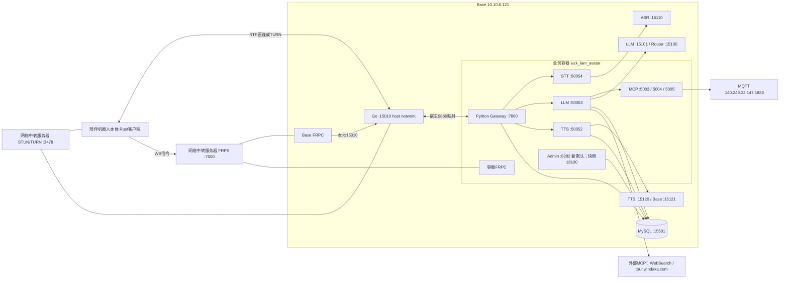

# AI Voice 服务器及服务交接清单

采集日期：2026-09-11，Asia/Shanghai；本轮为 SSH、Docker inspect、/proc、HTTP GET、数据库只读事务的采样。服务会变化，所有 PID、计数、版本及健康结果均是采样事实。源码基线 main@9931966；未重启、部署、改配置或触发机器人任务。

## 9月14日网络迁移补充

新增资料见[WebRTC网络迁移与机器人运维](WEBRTC_NETWORK_HANDOVER.md)。新入口为新网络中转服务器15011明文WS，经NGINX→回环15010→新FRP→Base Go；旧隧道保留。资料报告Go探针已修复且healthy，机器人192.168.3.5的robot_rust.service已切换。本轮未重新登录；下列9月11日端口、PID、配置207/208、MCP及Admin状态保留为历史快照，未被此次资料重新验证。

## Admin 内网访问变更（代码已修改，服务器未部署）

Admin默认监听改为 `0.0.0.0:8282`；业务容器已有Base `15282→8282` 映射，部署新代码并重启Admin后，使用 `http://10.10.6.121:15282`，不依赖Admin FRPC。环境变量显式覆盖仍优先；现有Compose显式18100配置保持原含义。以下PID、18100监听及HTTP检查是变更前快照，不是新配置已部署的证明。

## 优先关注

1. Base主机已核验；`:9022` 是其业务容器SSH。FRP、STUN/TURN统称“网络中转服务器”，当前由交接方个人提供、后续移交他人；不在本文记录其IP/域名。
2. 当前 Go 在 Base15010；业务 Python 在容器7860，由 Base9860 转发。仓库默认8282不是现场Go入口。
3. 9月11日Go探针unhealthy为历史问题；9月14日补充资料报告路径已修正、running/healthy，见迁移说明。
4. 交接方确认代码以GitLab为准，部分内容未更新。业务目录无.git；251个选定文件220同、18异、13缺，保留部署差异，不将服务器作为交接代码真相源；生产commit仍未知。
5. robot/utils MCP工作目录和日志fd指向已删除对象；业务容器restart=no且没有挂载，恢复前必须保全可写层。
6. 三个配置运行态都是207，数据库最大快照208；交接方确认没有保存后故意不发布的配置。差异原因未核实，本轮未Reload。

交接方确认：当前仓库功能均已交付，无已知业务遗留问题；Rust客户端在陪伴机器人本体。上述现场观测保留为运维参考，不作为未交付工作。

统一待确认事项编号见 [HANDOVER_MISSING_INFO.md](HANDOVER_MISSING_INFO.md)。

## 1. 服务器资产

| 编号 | 主机/IP | 用途 | OS | CPU | GPU | 内存/磁盘 | 登录用户/方式 | 本次状态 |
|---|---|---|---|---|---|---|---|---|
| A | Base / 10.10.6.121:22；hostname chase | Go实时网关、模型、DB、FRP、业务容器宿主 | Ubuntu18.04.6；kernel4.15.0-112-generic | 2×Xeon Gold6338，128逻辑CPU |8×RTX A6000，各49140MiB；driver535.146.02|内存503GiB；/938G使用84%；datasets3.6T使用69%|chase；SSH密码|可登录，Docker可读|
| A-C1 | 同主机9022→容器22；wzk_lam_avatar；hostname710197baf3c0 | Python业务服务 | Ubuntu22.04.4；共享宿主内核 | 共享宿主，实际quota未核 | 容器env NVIDIA_VISIBLE_DEVICES=all；非推断实际占用 | 无Mounts；可写层，配额未核 |root；SSH密码|可登录，核心进程在运行|
| B-old | 旧网络中转服务器（不列地址） |旧WSS/FRP保留；个人服务器后续移交|【待补充】|【待补充】|【待补充】|【待补充】|另行移交|9月14日资料报告未下线|
| B-new | 新网络中转服务器（不列地址） |NGINX、FRPS、coturn|Ubuntu18.04.6（资料）|未采|未采|未采|chase，SSH22|9月14日资料报告已启用；本轮未复测|
| C | 192.168.3.5 / peiban1 |陪伴机器人Rust客户端|未采|未采|未采|未采|windaka，SSH22|资料报告用户服务active/running|

Base工作目录 `/home/chase/datasets/wzk/deploy`；业务工作目录 `/root/vad_asr_llm_tts_grpc`。Docker24.0.2、Compose v2.18.1。`sudo -n true` 未通过，只说明免密sudo未通过，不能据此断言无sudo资格。chase实际可执行docker inspect/ps。

`wzk_lam_avatar` bridge地址本次172.17.0.2，IP并非稳定部署契约；restart=no，启动时间2026-08-06T01:12:19Z，Config.Cmd=/bin/bash。未观察到rc.local/supervisor/root crontab文件，不足以证明没有任何外部自启机制，冷启动方式待M06。

## 2. Base 服务清单

表内部署目录相对 `/home/chase/datasets/wzk/deploy`。日志统一用对应容器 `docker logs`；配置文件可能含凭据，不将原文复制入Git。

| 服务器 | 服务/容器 | 用途 | 协议/端口 | 部署目录 | 配置位置 | 启动方式 | 日志位置 | 是否自启 | 当前状态 |
|---|---|---|---|---|---|---|---|---|---|
| A | wzk-go-gateway-go-gateway-1 | Go实时网关 |HTTP/WS15010；UDP35500–35600|go-gateway|docker-compose.yml；环境来自该部署|Compose service go-gateway；host network；/go-gateway/go_voice_gateway|docker logs|unless-stopped|9月11日HTTP200、unhealthy；9月14日资料报告探针修复后healthy|
| A | wzk-stt | ASR模型 |HTTP15110→8000|stt|docker-compose.stt.yml|Compose service wzk-stt|docker logs|unless-stopped|/health200|
| A | wzk-llm-mini | 对话模型 |HTTP15101→8000|llm-mini|docker-compose.llm-mini.yml|Compose service wzk-llm|docker logs|unless-stopped|/health200|
| A | wzk-llm-router | Router模型 |HTTP15100→8000|llm-router|docker-compose.llm-router.yml|Compose service wzk-llm|docker logs|unless-stopped|/health200|
| A | wzk-tts | CustomVoice模型 |HTTP/WS15120→8000|tts|docker-compose.tts.yml|Compose service wzk-tts|docker logs|unless-stopped|/health200|
| A | wzk-tts-base | Base模型 |HTTP/WS15121→8000|tts-base|docker-compose.tts.base.yml|Compose service wzk-tts-base|docker logs|unless-stopped|/health200|
| A | wzk-mysql | server-config |TCP15501→3306|mysql-server|docker-compose.yml、mysql/conf.d/my.cnf|Compose service wzk-mysql|docker logs|unless-stopped|SQL只读成功，MySQL8.4.10|
| A | wzk-frp-wzk-frp-1 | Go信令外部映射 |TCP出站7000；本地15010|frp|docker-compose.yml、frpc.ini|Compose service wzk-frp；host network；/frpc|docker logs|unless-stopped|进程/容器存在；远端端到端未验|
| A | wzk_lam_avatar | 业务容器 |SSH9022等，见下表|无Compose来源标签|docker inspect；创建命令未取得|现有容器/bin/bash|业务日志见下一表|no|运行；无挂载|

还观察到wzk_soulx_pilot10、starvla_container、Hy_vlm等容器，以及deploy/llm、llm-qwen38-27b、tts-sing目录。存在不等于属于当前AI Voice主流程；共享GPU/其他项目归属与停止权限待M07，不将其列为可任意重启的语音服务。

### 模型镜像与资源

| 容器 | 镜像tag | GPU配置 | 运行命令中模型/served名 |
|---|---|---|---|
| wzk-stt |wzk/vllm-qwen3-asr:v0.21.0-audio|1|/models/Qwen3-ASR-1.7B；Qwen3-ASR-1.7B|
| wzk-llm-mini |vllm/vllm-openai:v0.21.0|4|/models/Qwen/Qwen3___5-9B；qwen3-5-9b|
| wzk-llm-router |vllm/vllm-openai:v0.21.0|5|/models/Qwen/Qwen3___5-4B；qwen3-5-4b|
| wzk-tts |vllm/vllm-omni:v0.22.0|6|/models/Qwen3-TTS-12Hz-1.7B-CustomVoice；qwen3-tts|
| wzk-tts-base |vllm/vllm-omni:v0.22.0|0|/models/Qwen3-TTS-12Hz-1___7B-Base；qwen3-tts-base|

模型挂载：宿主 `/home/chase/datasets/wzk/models`→`/models`；`hf-cache`→`/root/.cache/huggingface`。TTS Base额外 `/home/chase/datasets/wzk/deploy/tts-base/base`→`/base`。MySQL数据在 `/home/chase/datasets/wzk/deploy/mysql-server/mysql/data`，配置和init也挂载。模型具体文件哈希、下载源及数据库备份未验证。

当前Docker image ID（不是可直接pull的registry RepoDigest）：

```text
Go       sha256:027cd704e401ebec212a6c336632578e90a8fb08ffe15aecb5ce6032bfc5b47e
ASR      sha256:b041d40ce6b03976c91b89f043bf32dfc3f3adb2ecd77d25e2e2a9c9bd1856a0
LLM两种  sha256:2497255b1272ba3ae9581acd51349f840038f228d0709cd9f6a142d39008d290
TTS两种  sha256:72b8699d2a20c485776d3c90cd1741f497fdf9a03fddd4d4220e1e3830fb6290
MySQL    sha256:dd7c4367a6178341e8331591a392d7258fef304ae12b9cadb4e83965b1f0283f
FRP      sha256:6f37c8477eeea926245da72ab5151a3600e221888188e50309b86177cec555e8
业务基镜像 sha256:7546ae5037ab0ee73c7ce76b9707ff342fe9ff3126cffea639454de831e545f6
```

业务基础镜像为wzk-torch:cuda12.4-cudnn-devel-ubuntu22.04-py312-torch2.5.1。镜像名的CUDA标签不是本次toolkit执行验证，镜像ID也不包含业务容器后续可写层变更。

## 3. 业务容器服务清单

目录相对 `/root/vad_asr_llm_tts_grpc`；项目虚拟环境为该根下 `env`。**所有PID仅供核对本次快照，操作前重新查询。** `/proc/exe`指向miniconda python3.12，但进程PATH/VIRTUAL_ENV证明使用项目env，不能只看exe链接选择解释器。

| 服务器 | 服务 | 用途 | 协议/端口 | 部署目录 | 配置位置 | 启动方式（观察argv） | 日志位置 | 是否自启 | 当前状态 |
|---|---|---|---|---|---|---|---|---|---|
| A-C1 |STT PID1188|ASR wrapper|gRPC50054|stt|根.env、config.py|python stt_grpc_server.py；nohup由用户确认|stt/nohup.out|待确认|进程/监听存在|
| A-C1 |TTS PID1841|语音合成wrapper|gRPC50052、HTTP18052|tts|根.env、DB Profile|python tts_grpc_server.py|tts/nohup.out|待确认|config207，status成功|
| A-C1 |LLM PID75282|对话/路由/工具|gRPC50053、HTTP18053|llm|根.env、DB Snapshot|python llm_grpc_server.py|llm/nohup.out|待确认|config207，status成功|
| A-C1 |Gateway PID74674|语音编排|HTTP/WS7860|gateway|根.env、gateway/config.py、DB|python gateway_server.py|gateway/nohup.out|待确认|healthz200，config207|
| A-C1 |Admin PID36898|管理API及页面|HTTP18100|admin-ui/backend|根.env、backend/config.py|python app.py|admin-ui/backend/nohup.out|待确认|/health200；受保护API401|
| A-C1 |Robot MCP PID14633|机器人MQTT工具|HTTP5003|mcp_servers (deleted)|根.env、启动时加载代码|python robot_sse_server.py|mcp_servers/nohup.out (deleted)|待确认|进程/监听存在；日志路径异常|
| A-C1 |Utils MCP PID14674|通用工具|HTTP5004|mcp_servers (deleted)|根.env、启动时加载代码|python utils_sse_server.py|mcp_servers/nohup.out (deleted)|待确认|进程/监听存在；日志路径异常|
| A-C1 |Singing MCP PID63085|歌曲控制|HTTP5005|mcp_servers|根.env、singing/catalog.json/voices.json|python singing_sse_server.py|mcp_servers/nohup.out|待确认|进程/监听存在|
| A-C1 |FRP PID3432|业务/管理端口映射|出站TCP7000|/root|/root/frpc.ini|./frpc|/root/nohup.out|待确认|进程存在；远端未验|

共同.env与启动shell中变量的完整移交方式见M11。本次仅输出变量名及选定非秘密端点；未复制.env。业务进程已有QWEN_LLM_API_KEY启动环境项，值未读取进文档；当前代码是否使用旧项需按生产源码核对，恢复时保留原环境来源。

### 容器端口映射及健康结果

| Base端口 | 业务容器端口 | 核验 |
|---|---|---|
|9022|22|SSH成功|
|9860|7860|Python /internal/status成功；正确健康路径/healthz|
|15282|8282|Admin新配置的内网入口；修改前采样未见8282监听，尚未部署验证|
|9999|9999|映射存在；当前容器未见9999监听|

`ss`在业务容器未安装，本轮通过/proc/net/tcp/tcp6读取监听。STT/LLM/TTS、MCP、Admin端口不在上述Docker published ports中；可通过容器内loopback或已配置FRP/SSH隧道访问。

## 4. 登录和权限

```bash
ssh -p 22 chase@10.10.6.121
ssh -p 9022 root@10.10.6.121
```

账号口令由交接方已提供给本轮核验，本文不保存口令/Token/API Key/私钥。接收人通过公司约定渠道获得权限，不能把聊天里的登录成功视为接收人已获授权。Base为普通chase账号但可操作Docker；业务容器为root；sudo需口令与可执行范围、GitLab权限和网络中转服务器的接管安排待M01/M03/M11。

Admin部署新配置后的内网入口：`http://10.10.6.121:15282`。对应容器监听`0.0.0.0:8282`，复用既有Docker端口映射，无需Admin FRPC或SSH转发。Admin账号与SSH账号不是同一身份；登录鉴权保持启用。旧Admin进程仍是早前18100快照，本轮未重启。

## 5. 服务依赖与通信拓扑（9月11日历史）

新入口不直接指向FRPS7000：客户端使用NGINX15011，7000仅为FRP控制连接。9月14日当前拓扑、新旧隧道和机器人路径请见[迁移说明](WEBRTC_NETWORK_HANDOVER.md)。



FRPS和STUN/TURN按交接方说明统一称为网络中转服务器；图中按服务拆成两个节点，不表示两台物理机。服务器地址和登录资料由交接方另行移交。FRP隧道是TCP端口映射，RTP媒体链路另由ICE决定。

实际Base FRPC连接网络中转服务器的7000端口；remote15010→Base127.0.0.1:15010。业务FRPC同一server：remote15054→容器7860、18100→18100、15828→8282、15999→9998、15823→8283；后3个目标在变更前采样未观察到监听。Admin改用内网15282后不需要18100或15828的FRPC映射；其他语音/历史映射不在本轮移除范围，本轮未修改frpc.ini。

Go ICE配置指向网络中转服务器的STUN3478及TURN3478（UDP/TCP）；未做本轮relay媒体验证，未取得TURN服务端部署/证书/防火墙。Base未观察到nginx/turnserver/frps，网络中转服务器的接管时间/人员及其他共享服务归属待M01/M07。

数据库当前mcp_servers有utils_remote→127.0.0.1:5004/mcp、robot_remote→5003/mcp、singing_remote→5005/mcp，另有WebSearch `https://dashscope.aliyuncs.com/api/v1/mcps/WebSearch/mcp` 和任务服务 `https://tour.windaka.com/mcp`，均enabled。这里是数据库当前行，不保证运行207和每个Bot绑定都启用同样集合；未触发任何工具调用。

## 6. 运维操作

### 6.1 只读检查

在Base：

```bash
cd /home/chase/datasets/wzk/deploy
docker ps --format '{{.Names}}\t{{.Status}}\t{{.Ports}}'
nvidia-smi
df -h / /home/chase/datasets
docker logs --tail 100 wzk-go-gateway-go-gateway-1
curl -fsS http://127.0.0.1:15010/healthz
curl -fsS http://127.0.0.1:15110/health
```

其余模型健康端口15101/15100/15120/15121。业务容器：

```bash
cd /root/vad_asr_llm_tts_grpc
ps -eo pid,ppid,comm
pgrep -af gateway_server.py
curl -fsS http://127.0.0.1:7860/healthz
curl -fsS http://127.0.0.1:7860/internal/config/status
curl -fsS http://127.0.0.1:18053/internal/config/status
curl -fsS http://127.0.0.1:18052/internal/config/status
curl -fsS http://127.0.0.1:8282/health  # 新默认；变更前进程为18100
tail -n 100 gateway/nohup.out
```

完整status/log响应仅在获授权终端检查，包含运行信息时不直接复制进公共工单。查看具体PID时用 `readlink /proc/<PID>/cwd`、`readlink /proc/<PID>/fd/1`、`tr '\0' ' ' < /proc/<PID>/cmdline`，确认身份；cmdline可能含凭据，应避免无选择全量导出。

### 6.2 现有Docker容器启停

以下是接手窗口运维命令，**本轮未执行**。表中每一项Base容器均可用相应名称替换；启动顺序DB/模型→Python wrappers/MCP→Python Gateway/Admin→Go→客户端。停止按相反依赖顺序评估，停止数据库/模型会影响多个会话。

```bash
# 示例：只操作已存在的Go容器，不build、不recreate
docker stop wzk-go-gateway-go-gateway-1
docker start wzk-go-gateway-go-gateway-1
# 如选择单次重启，可用下行替代上面的 stop/start，不要重复执行
# docker restart wzk-go-gateway-go-gateway-1
docker logs --tail 100 wzk-go-gateway-go-gateway-1
curl -fsS http://127.0.0.1:15010/healthz
```

模型/DB/FRP使用服务清单对应容器名和健康方法；也可在确切部署目录执行 `docker compose -f <表中配置文件> ps/start/stop/restart <表中service>`。**已有容器恢复不必执行up --build。** `docker start wzk_lam_avatar`只启动容器，并不能保证nohup业务进程自动恢复；不应把docker rm/recreate当普通重启。

### 6.3 nohup进程启停

现场未保留可确认的PID文件管理方式；根logs/run不存在。按本次/proc重建的入口如下，启动命令【待人工验证】，需在接手窗口先确认原进程已停止、端口空闲、配置和资源齐全。MCP有deleted目录异常，尤其需确认当前文件即应运行版本。

| 服务 | 工作目录（相对业务根） | 已观察入口 | 日志 |
|---|---|---|---|
|STT|stt|stt_grpc_server.py|nohup.out|
|LLM|llm|llm_grpc_server.py|nohup.out|
|TTS|tts|tts_grpc_server.py|nohup.out|
|Gateway|gateway|gateway_server.py|nohup.out|
|Admin|admin-ui/backend|app.py（新默认0.0.0.0:8282）|nohup.out|
|Robot MCP|mcp_servers|robot_sse_server.py|nohup.out（旧进程已deleted）|
|Utils MCP|mcp_servers|utils_sse_server.py|nohup.out（旧进程已deleted）|
|Singing MCP|mcp_servers|singing_sse_server.py|nohup.out|

以Gateway为例：

```bash
# 停止：重新查询并逐项核对PID、cwd、cmdline；不要复制历史PID或pkill python
pgrep -af gateway_server.py
readlink /proc/<确认PID>/cwd
kill -TERM <确认PID>
# 确认进程已退出、端口释放后，恢复原环境来源，再启动
cd /root/vad_asr_llm_tts_grpc/gateway
nohup /root/vad_asr_llm_tts_grpc/env/bin/python gateway_server.py >> nohup.out 2>&1 < /dev/null &
tail -n 100 nohup.out
curl -fsS http://127.0.0.1:7860/healthz
```

重启=先停止并确认退出，再按表中cwd/入口启动，再检查监听、配置版本及功能。STT/TTS/LLM日志在各自子目录；三个MCP当前使用同一路径，不能假定日志能按服务完整区分。不要向/proc fd追加、截断或清理已删除日志；先安排保全与归属确认。

FRPC在/root下，已观察argv为`./frpc`，默认读取frpc.ini；重建命令为 `cd /root` 后 `nohup ./frpc >> nohup.out 2>&1 < /dev/null &`，同样须确认旧进程已停止与原环境一致。不要改端口或清旧映射作为本次交接的一部分。

### 6.4 冷启动、备份和回滚

目前仅确认可读与运行快照，**未演练停机/冷启动/恢复/回滚**。数据库数据目录、模型权重、业务容器可写层、根.env、TTS参考音频、singing/audio、Turn Gate模型、Go binary、设备端binary及其配置都需纳入交接恢复包；备份位置/频率/责任人/恢复耗时待M06。

回滚不能简单等同git checkout release分支：需同时匹配协议、依赖、模型、DB schema/Snapshot与设备binary。现场无生产Git HEAD，回滚对象应先固定当前文件/镜像/配置证据。数据库只保留10个配置快照，不覆盖模型、容器文件或完整灾备。

## 7. 运行证据与版本差异

### E01：HTTP、协议和配置

- Go15010/healthz、Python7860/healthz、Admin18100/health及5个模型/health均返回200。
- 误探测Python /health和LLM/TTS /internal/status返回404，随后使用上述正确路径成功；404不能写成服务故障。Admin受保护/api/health返回401，其公共/health返回200。
- Go `/internal/status`：M1 mode=m1；client_event/input_audio active；interrupt/playback_report=true；Turn Gate shadow/active=true；barge_in=false；Opus48000/mono/ptime20；Python internal WS=ws://127.0.0.1:9860/internal/voice/ws。
- 采样累计：M1 active_sessions=1，input_audio_successes=10、input_batch_successes=43，client_event_successes148/failures24，heartbeat_failures0。失败计数原因未追溯，不能直接归为当前故障或从成功数得出质量指标。
- Python runtime：source=snapshot、config_version207、loaded_at2026-09-09T09:56:50Z、bot_count10、robot_count4；max_connections20；上游grpc均127.0.0.1。旧/ws active=0与M1 session=1不矛盾。
- LLM/TTS `/internal/config/status` 同为207；DB实际8.4.10，wzk_ai_voice，最新快照208，保留199–208共10份；表行计数bots10、robots5、tts_profiles12（CustomVoice5/Base7）。行计数不等于启用运行实体数。bots.max_response_chars已存在。

### E02：Go健康检查异常（9月11日历史，9月14日资料报告已修复）

`docker inspect`：State.Health.Status=unhealthy；某次FailingStreak15195；检查命令`/go_voice_gateway --healthcheck`。检查输出先server_listening，再`listen tcp 0.0.0.0:15010: bind: address already in use`。容器主命令却是`/go-gateway/go_voice_gateway`，后者由宿主目录挂载。故已确认健康探针没有正常完成健康判断；9月14日资料确认旧探针使用镜像内旧程序，现场改为实际挂载路径后healthy。此段保留故障历史，本轮未替换任何程序，生产binary提交来源仍待M08。

实际宿主Go binary SHA256：

```text
/home/chase/datasets/wzk/deploy/go-gateway/go_voice_gateway
529c54e0ab5609d7481879d950196bc7e2904354401e5fbdc5a9c45d9b95f89e
```

Base未找到go工具，未提取build VCS信息；Go源码默认M1音频disabled/shadow但现场active，env也未显式设置该项，生产binary来源不可由仓库HEAD推定。

### E03：源码比较

交接方已明确以GitLab为准，并说明“有些没更新上去”。本轮不根据下面的差异反向更新GitLab，也不自动将GitLab部署到服务器。

比较选取Git跟踪的gateway/llm/stt/tts/mcp_servers/server_config/admin-ui/singing/scripts/turn-gate下`.py/.proto/.json/.sql/.sh/.txt`及根config、voice_logging、voice_quick_replies、requirements共251个文件，以SHA256比较同名部署文件：220一致、18不同、13缺失。此范围不是全目录逐字节镜像校验，不包含Go/Rust binary、所有前端源码或远端额外文件，也不能确认内存已加载代码等于磁盘。

18个不同文件：

```text
admin-ui/frontend/package.json
config.py
llm/llm_grpc_server.py
requirements.txt
scripts/benchmark_llm_tts_chain.py
scripts/nohup_service.sh
scripts/probe_python_gateway_internal_voice.py
scripts/probe_python_gateway_ws_audio.py
scripts/smoke_go_webrtc_python_gateway.py
scripts/validate_compose_v3.py
scripts/webrtc_weak_network_matrix.py
stt/__init__.py
stt/asr_providers.py
stt/stt_grpc_server.py
stt/stt_service.proto
turn-gate/configs/single-duplex-v1-test.json
turn-gate/scripts/simulate_turn_gate_timing.py
voice_quick_replies.py
```

13个缺失文件均在scripts：ai_preflight.py、ai_quality_gate.py、capture_evidence_environment.py、check_repo_hygiene.py、eval_acceptance.py、eval_bot_utils_matrix.py、eval_runner.py、eval_vision_e2e.py、local_mqtt_fixture_broker.py、run_dev_harness.py、run_natural_barge_in_matrix.py、validate_eval_gold.py、validate_evidence_report.py。缺失评测工具不等于主业务缺失；不自动补拷或部署。

抽样线上SHA256：

```text
gateway/gateway_server.py 62e35aad3fc0ffc18865aa43333c66286f6d0b8cd75faafb76837daf9d9755ff
config.py 99c68a01edf48e6bbf98d0946a4520b3bc0e0e8f42ebabddd0a7d4956141685e
llm/llm_grpc_server.py 69c8adf0d37f65a389d8125c3353a4bde3fc4e8815fb64e803b9163e356bea15
stt/stt_grpc_server.py aafca28f368f4216fbd001310e4d11c552ad1757ec29482fc3bb43d0aafa195e
tts/tts_grpc_server.py 17f0cbd461ba97eed5711f86e52905bf32572268fcdadb188e0e84d10d7a22f6
server_config/repository.py cdfe674321638f6bc2e594b5a3b18cc9007a3aa1baa9b6367306b55024a457cc
```

### E04：Python依赖和独立资产

业务实际Python3.12.3，prefix=/root/vad_asr_llm_tts_grpc/env。通过importlib.metadata读取发行包版本：grpcio1.76.0、protobuf6.33.5、openai2.24.0、mcp1.26.0、httpx0.28.1、PyMySQL1.1.3、fastapi0.115.9、starlette0.45.3、uvicorn0.41.0、websockets16.0、opuslib3.0.1、numpy2.3.5、onnxruntime1.28.0。这是核心包清单，不是完整freeze。SSH默认python缺pymysql，项目env正常；未安装或修改依赖。

singing/audio有24个文件、turn-gate/models有14个文件。目录存在/文件计数不能证明内容完整或符合音频规格。STT日志约3.5MB、LLM2.8MB、TTS12.7MB、Gateway11.1MB；日志为单次大小快照，轮转策略未确认。MCP旧进程日志deleted风险见前文。

## 8. 本轮未执行的验证

未做真实麦克风/扬声器语音、TURN relay媒体、模型推理、MQTT动作、前端业务验收、数据库迁移、Reload、重启、冷启动、恢复、Build/Package。服务存在、HTTP200、内部成功计数与上述验证分别管理。网络中转服务器的接管安排和接收人资料仍待补充；不把交接文档完成写成这些验证已经完成。
