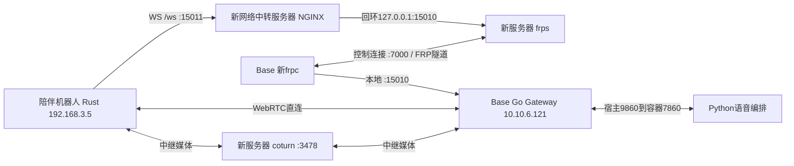

# WebRTC 网络迁移与机器人运维交接

更新：2026-09-14。本文是用户提供的《WebRTC新服务器交接说明.md》的仓库整理版，替代9月11日网络拓扑、Go健康探针故障和机器人运维入口的旧描述。证据来自该补充说明及本地附件，本轮没有重新登录服务器或执行部署。其余数据库、模型、Admin和MCP状态仍以各自采样日期为准。

最新补充（2026-09-14，交接方确认）：当前项目服务已全部切换部署到新服务器 **112.6.202.236**，SSH为 `chase@112.6.202.236:22`，密码单独交接。旧域名 **frp.wzk.icu** 为个人服务器，不纳入公司服务器接管，后续可能停止；可能存在未知测试机器，由接收方按本文切换。旧服务不是持续依赖或回滚保障。下文新服务器占位符均替换为112.6.202.236；保留的旧隧道配置仅作迁移历史参考。

## 1. 当前方案与范围

| 项目 | 补充资料报告的9月14日状态 |
|---|---|
| 原生客户端信令 | `ws://<新网络中转服务器IP>:15011/ws`；明文WS，必须使用ws协议 |
| STUN/TURN | 新网络中转服务器3478；沿用原认证值；无turns服务 |
| 真实机器人 | 192.168.3.5 / peiban1上的Rust用户服务已重启，进程环境确认新入口 |
| 旧网络入口 | 最新确认：当前项目已迁移；未知测试机器可能仍使用旧个人入口，发现后按手册切换；旧服务可能停止 |
| 新域名WSS | 未启用，无可用证书，不能当作备用可用入口 |
| 网页语音 | 不在本次原生WS入口交付范围；没有新的HTTPS网页入口 |
| Go健康检查 | 现场探针修正为实际挂载binary，报告running/healthy；不再把旧unhealthy列为当前未修故障 |
| 版本 | 没有绑定Go/Rust binary到4.0/4.1提交；网络迁移不等于任一分支完整发布验收 |

明文WS不保护信令和注册认证信息；WebRTC媒体仍使用自身加密传输。此处记录补充资料中的既定方案，不重新申请证书或擅自改变协议。

## 2. 拓扑和端口



NGINX只转发精确路径`/ws`并保留WebSocket Upgrade；其他路径404，包括`/internal/status`。公网入口的404不能判为Gateway宕机；内部健康通过新服务器回环15010或Base15010检查。

| 位置 | 端口/协议 | 用途 |
|---|---|---|
| 新中转服务器 |15011/TCP|NGINX原生客户端WS入口|
| 新中转服务器 |7000/TCP|frps控制连接，tls_only=true|
| 新中转服务器 |127.0.0.1:15010/TCP|FRP映射，仅供本机NGINX访问|
| 新中转服务器 |3478/UDP、TCP|STUN/TURN接入|
| 新中转服务器 |49160–49260/UDP|TURN中继端口范围|
| Base |15010/TCP、35500–35600/UDP|Go信令/管理与WebRTC媒体；不同于TURN中继范围|
| 新中转服务器 |80/TCP|历史ACME验证站点，非当前WS依赖|

## 3. 新网络中转服务器

SSH用户chase、端口22；Ubuntu18.04.6。新服务器资产归属和运维责任仍待确认，不沿用“旧个人服务器”的归属推断。

| 服务 | 程序/配置/管理 | 状态来源：补充资料 |
|---|---|---|
| NGINX |/etc/nginx/sites-available/voice-ws-ip；sites-enabled同名链接；systemctl nginx|启用15011明文WS；proxy_read/send_timeout均3600秒|
| FRPS |voice-frps.service；/etc/systemd/system/voice-frps.service；用户chase|已启动且开机启动|
| FRPS程序/配置 |/home/chase/deploy/voice-ingress/frp_0.38.0_linux_amd64/frps；同级项目frps.ini|FRP0.38.0；只允许映射15010，proxy_bind_addr=127.0.0.1；沿用原token|
| coturn |/etc/turnserver.conf；/etc/default/coturn内TURNSERVER_ENABLED=1|coturn4.5.0.7-1ubuntu2.18.04.3；已启动且开机启动|

coturn使用lt-cred-mech、fingerprint、UDP/TCP3478，no-tls/no-dtls；listening-ip、relay-ip和realm对应新服务器，实际值由配置交接。禁止把脱敏占位符覆盖到现有配置。服务日志通过journalctl查看。

## 4. Base：当前新隧道、历史配置及健康探针

Base根目录 `/home/chase/datasets/wzk/deploy`：

| 项目 | 旧隧道历史配置（非持续依赖） | 当前新隧道 |
|---|---|---|
| FRPC配置 |frp/frpc.ini|frp/frpc.new-ingress.ini|
| Compose |frp/docker-compose.yml|frp/docker-compose.new-ingress.yml|
| 容器 |wzk-frp-wzk-frp-1|wzk-frp-new-ingress-frpc-1|
| 目标 |旧网络中转服务器7000|新网络中转服务器7000|
| 映射 |Base15010→旧服务器15010|Base15010→新服务器回环15010|

新隧道复用wzk-frp:ubuntu22-amd64镜像，host network、restart=unless-stopped、只读挂载配置，命令带`-c /frpc.ini`。

Go目录`go-gateway/`，环境`.env.go.gateway`、Compose `docker-compose.yml`；仍监听0.0.0.0:15010，ICE服务地址已指向新中转服务器，认证值保留。现场主程序和健康检查均使用`/go-gateway/go_voice_gateway`；旧镜像路径`/go_voice_gateway`曾误启动第二个监听进程，9月14日资料报告已修复。

**不要把现场挂载路径替换进仓库通用Compose。** `deploy/go-gateway/Dockerfile.ubuntu22`、`go_voice_gateway/Dockerfile.ubuntu22`都将程序放在`/go_voice_gateway`，仓库对应Compose主命令/探针与其一致。现场修复取决于其额外挂载，未改变通用镜像契约。

## 5. 机器人Rust客户端运维入口

| 项目 | 值（补充资料） |
|---|---|
| SSH / hostname |windaka@192.168.3.5，22；peiban1|
| 目录 |/home/windaka/Desktop/wzk/rust_client|
| 程序 / 启动脚本 |rust_client / run.sh|
| 用户systemd |robot_rust.service；/home/windaka/.config/systemd/user/robot_rust.service|
| 日志 |上述客户端目录logs/robot_rust.log、logs/robot_rust_error.log|
| Robot / Bot |companion_01 / xiaowen（当次连接）|
| 当次状态 |PID4791、active/running、NRestarts=0；PID不得直接用于后续kill|
| binary SHA256 |c7d81d9dca67a6ccd9fc3b400766c5481ad863df9af94bcc0dfb43b3c8479a1f|

身份凭据、音频、串口和Vision配置未改。修改run.sh不代表进程已加载；补充资料已通过重启后的/proc环境确认新WS。binary哈希不能推定其来源分支。

只读检查示例（各自在对应主机执行；本轮未执行）：

```bash
# 新网络中转服务器
systemctl is-active nginx voice-frps coturn
sudo nginx -t
sudo journalctl -u voice-frps -n 50 --no-pager
sudo journalctl -u coturn -n 50 --no-pager
curl --fail http://127.0.0.1:15010/healthz
# Base
docker inspect wzk-go-gateway-go-gateway-1 --format '{{.State.Health.Status}}'
docker compose -f /home/chase/datasets/wzk/deploy/frp/docker-compose.new-ingress.yml ps
# 机器人，以windaka登录
systemctl --user status robot_rust.service --no-pager
tail -n 100 /home/windaka/Desktop/wzk/rust_client/logs/robot_rust.log
```

机器人远程SSH缺用户总线时，在该shell按`id -u`确认UID后设置XDG_RUNTIME_DIR与DBUS_SESSION_BUS_ADDRESS；此次UID1000，其他机器不得照搬。

## 机器人配套职责确认（2026-09-14，交接方确认）

| 范围 | 责任归属 / 交接入口 |
|---|---|
| Vision图片生产程序、输出路径和更新维护 | 硬件人员负责；Rust消费配置的图片文件 |
| 本机5200角度接口及配套服务 | 硬件人员负责；Rust通过已配置接口对接 |
| 实际音频硬件、设备和配套维护 | 硬件人员负责 |
| Rust客户端源码与相关发行/构建信息 | GitLab仓库的rust_client/及相关文档；交接方已确认获取位置，不重复索要源码材料 |

这三项硬件配套工作作为跨团队接口说明，不列为交接方未完成的业务工作；具体硬件接收人可在正式交接表中填写。GitLab资料位置已明确，但不能仅据此声称现有设备binary与某个commit已经逐项匹配；该对应关系如需复现，由接手人员结合仓库和现有binary指纹核对。

## 6. 变更生效与回滚参考

下列步骤是接管时的操作参考，不是本轮执行记录。修改配置后应先检查语法，再只重载目标服务并核对进程环境及会话，不能重启全机或无关容器。

- NGINX：`sudo nginx -t`通过后`sudo systemctl reload nginx`。
- Go：在Base的go-gateway目录，`docker compose --env-file .env.go.gateway -f docker-compose.yml config --quiet`；变更生效用同样文件参数执行`up -d --no-deps --no-build --pull never go-gateway`。
- 新FRPC：`docker compose -f /home/chase/datasets/wzk/deploy/frp/docker-compose.new-ingress.yml restart frpc`；bind mount文件变化不会自动重读。
- Rust：客户端目录`bash -n run.sh`，再以windaka执行`systemctl --user restart robot_rust.service`。

备份语义：Go `.env.go.gateway.bak-20260914-105325`是TURN迁移前环境；`docker-compose.yml.bak-20260914-105512`是错误探针修复前配置。新服务器`/etc/turnserver.conf.before-migration-20260914`是安装后的初始配置，**不是旧服务器可用配置**。机器人`run.sh.bak-20260914-115425`备份时已经是新IP，**不能直接恢复旧入口**。

回滚先检查旧WSS仍可用，再定点恢复客户端GATEWAY_URL并重启其用户服务；信令回滚可继续使用新TURN。回滚旧TURN前需另测其认证和中继，不能假设迁移后已验证。不要全量覆盖环境文件，也不要恢复错误健康探针。只有确认无客户端依赖后才安排旧入口退役或停新服务。

## 7. 验证证据及边界

本轮只核对本地材料存在及SHA256，未复跑网络探针。

| 来源报告项目 | 结论范围 |
|---|---|
| coturn本机、Base到新TURN |报告UDP/TCP接入双向UDP中继通过；部分原始输出仅在原任务记录中|
| 新WS强制TURN探针 |rtc_61199ed6883e51e6注册、ICE、Peer、DataChannel成功，route=turn|
| 真实Rust客户端 |rtc_53316fe01938d1f9与Gateway会话匹配；选中192.168.3.5→Base的内网host-host直连；下行Opus轨道打开|
| Rust TURN支持 |日志提示跳过不支持的TURN TCP/TLS URL，native ICE使用UDP；服务端TCP通过不等于Rust支持TCP|
| 未测试范围 |完整ASR→LLM→TTS、真实采播、唤醒/打断、长稳、并发、多运营商；不宣称LIVE_VERIFIED/HARDWARE_VERIFIED|

独立强制TURN探针与真实设备直连不能合并成“真实设备强制TURN语音E2E”。一次RTT不等于语音时延指标。交接方此前确认功能已交付的项目事实保持不变，以上是此次迁移验证范围。

来源材料位于交接方提供的`reports/turn-migration-20260914/`目录，未将含中转地址的原文/JSON复制入仓库；移交原始证据时由交接方另行提供。本文保留摘要和指纹，没有创建指向不存在附件的相对链接。

```text
WebRTC新服务器交接说明.md
0f9faff80ef2e91dbf8a9026e8a88859941c1d89069146a0b044e7310513e99c
webrtc-public-ip-ws-force-relay.json
8f59b9fd2812386ff82323f680f06a2a1daee23efebea0aa8ceb4b6fc764d2d1
rust-client-192.168.3.5-connection.json
31c8edbd6ca4a1c898261370a5cddfe0a8ab673e29349021a10c2a1f2d445095
```

## 8. 证书历史与仍待交接

新域名WSS未启用；Certbot/lego/acme.sh的CA验证连接超时，没有成功证书。主机可出站访问CA、本机验证文件可读，不能证明CA入站可达；根因未确认，不写成运营商封锁或防火墙定论。

历史材料：`/home/chase/deploy/voice-ingress/voice-wss.nginx.conf.pending`、`/etc/nginx/sites-available/voice-ingress`及启用链接、`/var/www/voice-acme`、`/etc/letsencrypt`、`/etc/lego-voice-staging`、`/etc/acme-voice`、`/var/log/acme-voice-issue.log`。Certbot安装产生timer但无可续期证书；acme.sh未配置cron。没有为最终WS方案配置证书续期。不得直接启用引用不存在证书的pending配置，整理资料不删除这些文件。

仍需移交：新服务器资产/费用/运维负责人、权限与凭据渠道、Go部署来源、必要时核对设备binary与GitLab源码的对应关系、其他客户端清单及退役窗口、完整恢复资料。机器人目录和服务入口已补齐，不再要求交接方重复提供；统一见[待补充清单](HANDOVER_MISSING_INFO.md)。

## 9. 未知测试机器从旧入口切换

发现客户端仍引用旧个人域名时：先记录其当前配置和服务入口，再将信令入口改为 `ws://112.6.202.236:15011/ws`，按当前新服务器配置核对STUN/TURN地址与认证。机器人run.sh使用显式export，需修改实际生效脚本而非只改.env.local；其他测试程序按其真实配置来源修改。Go服务端ICE配置、Base新FRPC及新服务器服务维护沿用上文。

按设备对应手册让配置生效后，检查信令注册、ICE/RTP及实际语音收发；需要确认中继时另做强制TURN验证。保留本机配置备份，但不要假定旧个人服务器仍可用；发生问题优先按新入口链路排查。无需获取旧服务器账号或等待旧服务恢复。
