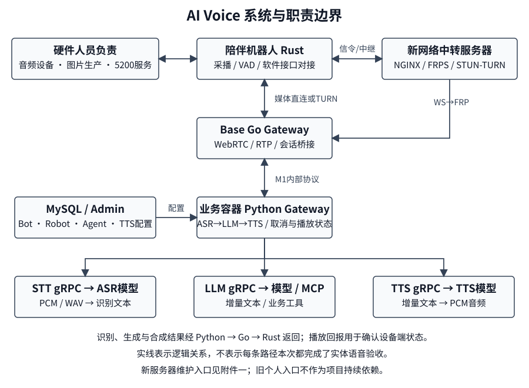

# 附件三：项目代码与技术资料交接说明

项目名称：AI Voice 陪伴机器人端云语音平台  
交接人：武子康  
整理日期：2026 年 9 月 14 日  
文件用途：源代码、系统设计、技术资料及开发维护方法交接，供打印归档与接手查阅。

## 一、交接范围与完成情况

本附件覆盖本仓库的 Rust 客户端、Go 实时网关、Python 语音编排、STT、LLM、TTS、配置中心、管理后台、工具接口及配套技术资料。

交接方已确认：**当前 GitLab 仓库功能全部交付，无已知业务遗留问题。** 仓库内保留的历史版本、实验实现、验证脚本和兼容开关属于技术资料，不自动认定为未完成工作。

本次整理以源代码核验、既有现场记录和交接方补充材料为依据，不包含重新构建、部署、刷写硬件或完整实体机器人语音复测。功能交付结论与本次核验范围分别记录，避免混淆。

Vision 图片生产程序、本机 5200 角度服务及实际音频硬件由硬件人员负责。Rust 客户端消费相应图片、接口及音频输入；这些跨团队接口不列为交接方未完成的业务工作。

## 二、源代码与版本基准

### 2.1 仓库位置

GitLab 项目地址：  
http://10.10.52.100/robot/peiban/ai-voice-realtime

仓库名称：ai-voice-realtime。接手人员通过公司 GitLab 获取仓库访问权限、源代码、提交历史及相关分支。Rust 源码与相关构建、发行资料位于本仓库，无需另行寻找独立源码包。

### 2.2 正文冻结前源码基线

| 分支 | 源码基线 | 用途 |
|---|---|---|
| main | dad544a | 主线交付与日常技术资料入口 |
| develop/v4.0 | a6672e7 | 4.0 对应开发分支及比较基准 |

以上短提交号为**本附件正文冻结前的源码基线**，用于定位编写依据。本批正式交接附件提交后，分支最新提交可能变化；最终归档文档提交应结合 GitLab 提交记录识别，不把后续文档提交误当作业务代码变化。

Git 分支基线、服务器部署目录以及现场 Go/Rust 可执行文件是三个不同对象。现有二进制来源如需复现，应比较文件指纹、构建参数与提交记录；不能仅凭分支名称推定正在运行的程序版本。

历史 release/v2.0、release/v3.0 等资料用于理解演进与明确兼容行为。文档内“候选”“实验”“验证”等历史措辞应按其形成日期解读，不改变本次确认的功能交付范围。

## 三、系统架构与部署关系



图示用于表达模块关系。现场端口、进程和启动配置以附件五及仓库服务器交接资料为准；仓库示例值用于开发参考。

### 3.1 业务主链路

陪伴机器人运行 Rust 客户端，完成采音、唤醒、语音活动检测、录音状态管理与音频播放。客户端通过 WebRTC 将 Opus 音频交给 Go 实时网关，控制消息通过对应信令或数据通道传输。

Go 网关负责连接和媒体收发，将输入语句交给 Python 语音编排。Python 依次调用 STT 识别、LLM/Agent/工具处理及 TTS 合成，再经 Go 将音频返回客户端。

管理后台维护 Bot、Robot、Agent、MCP、TTS Profile 等配置。配置发布形成运行快照，业务服务加载快照后处理请求；管理界面的“保存”与服务的“生效”应分别检查。

### 3.2 部署分层

Base 服务是宿主服务器，工作目录为 /home/chase/datasets/wzk/deploy。Go 网关、网络隧道及模型相关部署由该层的现场目录和编排管理。

业务容器位于 Base 内部，工作目录为 /root/vad_asr_llm_tts_grpc。Python 业务服务存在 nohup 启动方式；其他组件部分使用 Docker Compose。交接保持既有部署方式，不要求迁移为统一编排。

现场 Go 监听 15010，Python 宿主 9860 映射业务容器 7860。仓库默认 Go 8282、Python 7860 是通用开发配置，不能原样覆盖现场端口。

### 3.3 当前网络入口与验证边界

9 月 14 日补充材料说明，新网络中转服务器提供 **15011/TCP 明文 WS** 原生客户端入口，路径为 /ws。该入口使用 ws 协议，不应改写为 wss。

信令经新网络中转服务器的 NGINX、FRPS 及 Base FRPC 转发至 Go。WebRTC 媒体可由机器人与 Base 直连，或使用新网络中转服务器的 coturn 中继。

当前项目服务已切换到新网络中转服务器112.6.202.236；旧个人入口可能停止，未知测试机器的迁移提醒见附件六。新域名 WSS 和新的 HTTPS 网页语音入口不属于此次原生 WS 入口交付范围。

补充资料报告：真实机器人建立的是机器人与 Base 的内网直连；另一个独立探针验证了强制 TURN 通道。两组证据不能合并表述为“真实机器人经强制 TURN 完成语音全链路验证”。

新服务器登录入口见附件一；旧个人域名仅用于识别尚未迁移的测试机器，不作为项目持续依赖。

## 四、模块与代码导航

### 4.1 Rust 客户端

主入口为 rust_client/src/main.rs，读取环境配置、处理退出信号并启动 App。核心会话循环位于 rust_client/src/app.rs，对话状态定义位于 rust_client/src/state.rs。

音频采播代码位于 src/audio；外部音频前端 TCP 对接位于 src/audio_frontend；唤醒、VAD、打断分别位于 src/wake、src/vad 和 src/barge_in.rs。

传输接口及 WebRTC、WebSocket、兼容选择位于 src/transport；消息和音频帧契约位于 src/protocol。客户端配置集中在 src/config.rs。

Rust 内部音频处理使用 16 kHz。实际麦克风、声卡、串口、图片生产和 5200 接口的运行维护由硬件人员接管；软件人员维护客户端消费这些接口的代码及配置。

### 4.2 Go 实时网关

入口为 go_voice_gateway/main.go，服务路由、会话连接、WebRTC 回调和控制分发集中在 server.go；运行参数位于 config.go。

音频聚合和交句参阅 asr_handoff.go、asr_request.go、asr_runtime.go；Python 兼容桥接参阅 asr_python_bridge.go；M1 内部连接参阅 internal_voice_client.go 和 internal_protocol.go。

下行 RTP 封装位于 downlink_rtp.go；Turn Gate 与自然打断参阅 turn_gate_runtime.go、barge_in_runtime.go；注册鉴权与设备关系参阅 device_auth.go、session_registry.go。

Go 管理入口包含 /healthz、/internal/status 和内部 Vision 请求入口。新中转服务器只代理 /ws，不能用该公共入口的其他路径返回 404 判断 Go 服务宕机。

### 4.3 Python 语音编排

主入口为 gateway/gateway_server.py，提供普通 /ws、内部 /internal/voice/ws、运行状态及配置管理接口。

语音识别编排位于 asr_pipeline.py；音频格式位于 audio_protocol.py、opus_audio.py、wav_audio.py；会话与轮次参阅 session_manager.py、turn_context.py。

LLM/TTS 流式协同、直接 TTS、客户端事件和工作流由主入口及相应辅助模块处理。定位故障时应从当前请求分支继续跟踪，避免只依据模块名称判断实际执行路径。

播放回执、请求队列、追踪记录分别参阅 playback_report.py、request_queue.py、trace_recorder.py。追踪记录是尽力而为的内存数据，重启或淘汰后不能替代历史日志。

### 4.4 模型服务、配置和管理

| 目录 | 主要责任 | 接手入口 |
|---|---|---|
| stt | ASR RPC 与模型提供方适配 | stt_grpc_server.py、stt_service.proto |
| llm | 对话、Agent、工具和工作流 | llm_grpc_server.py、协议及子模块 |
| tts | TTS Profile、文本流与音频流 | tts_grpc_server.py、tts_service.proto |
| server_config | 配置存储、快照和加载 | snapshot.py、bootstrap 目录 |
| admin-ui | 配置管理后台 | backend/app.py、frontend |
| deploy | 模型与业务编排参考 | vllm、compose 等子目录 |
| scripts、test | 初始化、诊断和验证 | 按任务选择对应脚本或测试 |

模型权重、部署虚拟环境、数据库数据和现场音频资源不等同于 Git 源码内容，恢复时应与附件五、附件六一起使用。

## 五、一次语音交互的完整过程

1. 客户端启动后读取身份、信令、音频和唤醒配置，根据状态等待唤醒或进入可录音状态。
2. 客户端向网关注册，关联设备、Bot 和会话；交换 SDP 与 ICE 信息，建立 WebRTC 连接和数据通道。
3. 唤醒及 VAD 驱动录音状态，客户端发送录音起止控制并通过 RTP 上传 Opus 音频。
4. Go 接收 RTP，按输入语句聚合数据；依据运行配置使用 M1 内部协议或明确的兼容路径交给 Python。
5. Python 校验音频帧、会话和长度信息，解析当前机器人与 Bot 配置，将音频解码后送往 STT。
6. 当前语音编排使用单次 RecognizeSpeech RPC；协议中保留流式接口不代表当前每轮调用流式 ASR。
7. 有效识别文本进入 LLM，结合 Bot、Agent 和工具配置生成回答；空文本、无效文本和已取消结果按相应分支处理。
8. 增量文本进入 TTS，按 Profile 调用语音提供方；PCM 音频经 Python 编码、Go RTP 下发，由 Rust 缓冲并播放。
9. 实际播放结束后，客户端发送播放回执；发生打断时同时控制本地播放、服务端轮次与相关 RPC，防止过期回答继续播放。

会话结束或连接断开还涉及会话清理和 LLM 缓存清理。服务器返回完成消息表示处理或发送结束，并不单独证明扬声器已经播放完毕。

## 六、协议、标识与音频约定

### 6.1 标识含义

| 标识 | 含义 | 使用要求 |
|---|---|---|
| session_id | 多轮会话 | 各服务保持关联 |
| trace_id | 本次业务追踪 | 不用会话标识替代 |
| utterance_id | 一次输入语句 | 对应录音及提交 |
| round_id / playback_id | 回答与播放归属 | 取消和回执需匹配 |

### 6.2 音频封装

内部 PCM 常用 16 kHz、单声道、16 bit。Go WebRTC Opus 使用 48 kHz RTP 时钟、单声道、20 ms 帧时长；RTP 时钟与解码后的 PCM 采样率是不同概念。

VAF1 二进制帧由四字节标记、四字节大端 JSON 头长度、JSON 头和音频负载组成。该帧头版本为 1，不能根据历史“protocol-v2”称呼直接改变版本字段。

Opus 聚合负载使用 OPUSRAW1 标记，随后重复记录两字节大端包长度及 Opus 包。实现位置为 gateway/audio_protocol.py 和 gateway/opus_audio.py。

M1 JSON 信封包含版本、事件类型、会话、时间戳和负载，可附带追踪、语句、轮次及播放标识。事件包括会话打开、心跳、录音开始/批次/结束、打断、播放回执及响应完成。

M1 音频批次还校验方向、会话、编码、包数量和字节长度。字段不一致应定位生产者与消费者的契约，不以绕过校验作为正常维护方法。

### 6.3 服务间 RPC

STT 协议位于 stt/stt_service.proto；LLM 对话和工作流协议位于 llm/llm_service.proto、llm/workflow_service.proto；TTS 协议位于 tts/tts_service.proto。

LLM 使用流式文本响应；TTS 使用文本输入流与音频输出流。修改 proto 时应同步核对生成代码和调用两端，避免服务部署版本不一致。

现场 M1 已启用的能力以运行状态记录为准。源码默认值与现场可能不同；内部调用成功计数只说明对应调用，不代表完成实体机器人采播验证。

## 七、配置来源与生效机制

进程环境和根目录 .env 提供基础连接参数、模型地址、身份与运行开关。Python 配置读取以已存在进程环境优先；修改磁盘文件不表示现有进程自动加载。

MySQL server-config 保存 Bot、Robot、Agent、MCP、TTS Profile 及运行快照，是这些业务配置的运行时来源。bootstrap 下历史 YAML 用于初始化参考，不能替代现有数据库。

Admin 保存后需要按流程 Apply / Reload，并检查 Gateway、LLM、TTS 实际加载的版本。多个服务分别加载，局部失败时可能保留不同版本，应查看各服务状态。

Go 参数主要使用 GO_VOICE_GATEWAY 前缀，重点包括监听、Python 地址、ICE 服务、UDP 范围和内部协议开关。Rust 的 GATEWAY_URL 优先于分项地址配置。

TTS Profile 决定语音提供方和相关参数；Bot 决定对话模型、Agent 和工具绑定。发生“后台已改但回答未变”时，应先查快照、生效状态及本轮实际 Bot。

源码通用 Go 默认 8282 与 Admin 新默认 8282 在同机裸进程开发时会冲突。可将开发 Go 配为 15010 并同步客户端；Compose 显式配置和现场映射分别判断。

涉及凭据的实际值由账号、服务器和配置资料交接；本附件记录使用位置及生效方法。已有配置不能被示例文件或占位符整体覆盖。

## 八、开发环境与本地运行

### 8.1 环境准备

Python 镜像参考使用 3.11；既有业务环境记录为 3.12.3。依赖以 requirements.txt 及现场环境为依据，需要 Turn Gate 模型时再参考独立依赖文件。

Go 模块声明版本为 1.24.0，使用 Pion WebRTC。Rust 使用 edition 2021，WebRTC 构建需要 native-webrtc feature；仓库声明该 feature 不等于默认构建已包含它。

管理前端使用 Vue、TypeScript 和 Vite，Node 版本按 package.json 要求。音频相关原生库和目标设备权限按 Rust 说明及现有系统核对。

首次开发可从 .env.example 创建独立开发配置，再配置开发数据库、模型服务及测试设备。不要对现有生产数据库直接执行初始化脚本；数据库迁移应先核对已执行记录。

### 8.2 启动顺序

先确认数据库和模型端点可用，再在仓库根目录、相应 Python 环境分别运行：

```text
python stt/stt_grpc_server.py
python llm/llm_grpc_server.py
python tts/tts_grpc_server.py
python gateway/gateway_server.py
```

随后启动 Go 网关，核对其连接 Python 的地址与监听端口；再启动具备 native-webrtc 的 Rust 客户端。身份、信令入口、ICE 和音频设备参数需与开发环境一致。

管理后台入口为 python admin-ui/backend/app.py；前端在 admin-ui/frontend 按锁文件安装依赖后启动开发服务。后台端口与代理应成对核对。

Compose 开发参考 START.md 与 docs/docker-compose-v4.md。现场 nohup、挂载二进制及 Compose 混合部署的具体启停操作应使用附件五的运维说明，不能将本节开发入口当成生产恢复命令。

## 九、测试、验证与故障定位

按改动选择必要检查，不以全量构建、打包或无关测试作为日常修改前提。本附件中的命令和入口为接手参考，不是本次已执行记录。

Python 按修改模块运行对应 pytest 文件；Go 网关修改可运行 go test ./...；Rust 传输或配置修改可运行 cargo test --features native-webrtc。

Compose 修改可使用 scripts/validate_compose_v3.py 及 test/test_compose_v4_contract.py 检查相应约定。测试通过只覆盖其测试条件。

无麦克风语音回放参考 scripts/smoke_go_webrtc_python_gateway.py，须提供有效样本并核对参数。文件回放、内部探针与实体麦克风到扬声器的验证分别留档。

实体演示建议记录设备、时间、会话与追踪标识，检查唤醒、识别、回答、实际播放和打断；必要时再补充长时间运行、并发及不同网络场景。

故障定位依次检查：Rust 的连接与播放状态；Go 的注册、ICE、RTP 和 Python 桥接；Python 的轮次、ASR、LLM、TTS；最后进入具体模型或工具提供方。

只有信令可达时，继续检查实际媒体路由和 RTP 包；有回答但无声时，核对下行轨道、播放缓冲和回执；配置变化未生效时，核对运行快照与进程环境。

Python 的 active_connections 主要统计普通 /ws，不等于全部 M1 会话或实体设备数。健康检查、进程存在、调用成功与实体播放完成是不同层次的证据。

## 十、技术资料阅读顺序

| 次序 | 资料 | 阅读目的 |
|---|---|---|
| 1 | START.md | 通用启动、配置与最小验证 |
| 2 | docs/handover/README.md | 本次交接资料总入口 |
| 3 | docs/handover/AI_VOICE_HANDOVER.md | 深入技术说明及源码依据 |
| 4 | docs/handover/SERVER_SERVICE_HANDOVER.md | 现场部署、启停及采样记录 |
| 5 | docs/handover/WEBRTC_NETWORK_HANDOVER.md | 新旧网络、机器人服务及迁移证据 |
| 6 | docs/project-context-for-ai.md | 系统地图与模块关系 |
| 7 | docs/README.md | 其他协议、运维和专题资料 |

正式打印附件提供独立阅读入口，电子文档提供更细的路径、命令与历史依据。若历史文档与较新现场说明冲突，应核对记录日期、来源和实际运行状态。

## 十一、接收确认

请接收方现场核对 GitLab 访问方式、上述分支基线、模块说明、协议约定、配置来源、开发验证方法及电子技术资料位置，在主表确认资料接收范围。

本附件不将历史实验资料认定为未交付功能；硬件人员负责的配套接口按职责另行衔接。相关账号权限与现场资产的接收情况在对应附件登记。

## 本附件确认

请结合本附件内容及现场填写记录确认接收范围；未核对的项目不视为已完成。

交接人签字：________________　　接收人签字：________________

监交人签字：________________　　实际交接日期：______年____月____日
