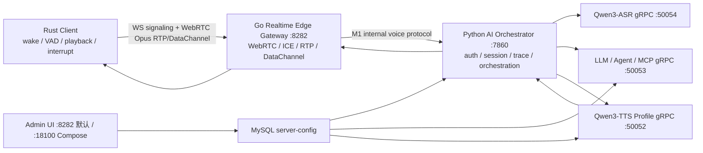

# 语音平台当前上下文

2026-09-14现场网络补充见[WebRTC迁移与机器人运维](handover/WEBRTC_NETWORK_HANDOVER.md)：新网络服务器WS15011、NGINX/FRPS/coturn、新旧隧道和机器人systemd入口。此为用户提供的部署快照，不改变仓库通用默认或声明完整语音验收。

> 面向后续 AI / 同事的当前事实摘要。历史实验、硬件实现和一次性压测结果不在本文维护。

交接主线 `main` 基于 `develop/v4.0` 的 `b820912d`，具体范围见 [交接说明](v4-main-handoff.md)。
V3 历史版本可通过原仓库的 `release/v3.0` 和 `v3.0.0` 追溯。
这只描述 Git 主线，不代表 V4 已正式发布、部署或完成实体机验证。

当前机器、服务器、代理和运行 Profile 见 `docs/ai-runtime-environment.md`；项目导航见根 `AGENTS.md`。

生产音频硬件、自研替代路线和自然打断的目标边界见
[`audio-endpoint-matrix.md`](./audio-endpoint-matrix.md)。不得把本机 TCP 软件 AEC 或
`wzk-mic` / `wzk-speaker` 的实验配置推断为生产机器人配置。

## 系统边界

这是一个 WebRTC-first 的端云协同语音系统：Rust Client 负责交互状态和音频端点，Go Gateway 负责实时传输，Python Gateway 负责 AI 编排，ASR/LLM/TTS 通过独立 gRPC 服务提供能力，MySQL `server-config` 和 Admin UI 管理运行态配置。

## 真实语音链路

1. 当前生产机器人由讯飞语音硬件模组完成 AEC、NS、AGC 和硬件 KWS。模组以系统默认
   麦克风/扬声器向 Rust Client 提供音频，不使用讯飞 SDK；KWS 通过串口 JSON 通知 Rust。
2. Rust Client 完成唤醒/VAD，按 100 ms 将内部 16 kHz mono PCM 编为 Opus。
3. Rust 通过 WebRTC RTP 上行音频，通过 DataChannel 发送 `audio_start`、`audio_end`、`interrupt`、播放回报等控制事件；WebSocket 只承担注册和 SDP/ICE 信令。
4. Go Gateway 做 ICE/STUN/TURN、RTP 顺序/丢包观测、session 和 downlink gate，将完整 utterance 以 `OPUSRAW1`/VAF1 语义桥接到 Python Gateway。
5. Python Gateway 解码/整理音频，调用 unary `RecognizeSpeech`；当前 STT 唯一实现是 Qwen3-ASR。
6. Python Gateway 把识别文本和受控语音上下文送入 LLM。LLM 按 Bot Snapshot 选择普通对话、Agent 或 MCP 工具。
7. LLM 增量文本直接提交到 TTS；不要恢复句子/段落聚合。TTS 按 `tts_profile_id` 解析 CustomVoice/Base provider。
8. TTS 音频经 Python Gateway 返回 Go Gateway，由 Go packetize 为 WebRTC RTP，下行到 Rust 播放。
9. Rust/Go/Python 使用 `trace_id`、`round_id`、`playback_id` 隔离迟到音频和打断事件。

当前 Go-Python 生产默认是 M1 `/internal/voice/ws`：真实用户音频、`client_event`、
interrupt、playback report、状态、TTS 音频和结构化终态使用同一 typed session。
M0 Python `/ws` bridge 只作显式回滚，不与已提交的 M1 轮次自动混跑或重放。

## 核心入口

- `rust_client/src/main.rs` / `app.rs`：客户端主状态机。
- `rust_client/src/transport/webrtc.rs`：native WebRTC、信令、RTP/DataChannel。
- `go_voice_gateway/main.go` / `server.go`：实时边缘入口和 session。
- `go_voice_gateway/asr_runtime.go` / `internal_voice_client.go`：RTP utterance 到 M1 Python 编排。
- `go_voice_gateway/asr_python_bridge.go`：M0 显式回滚 bridge。
- `gateway/gateway_server.py`：Python WebSocket/internal voice 入口和 ASR -> LLM -> TTS 编排。
- `stt/asr_providers.py` / `stt_grpc_server.py`：Qwen3-ASR adapter 与 gRPC 服务。
- `llm/llm_grpc_server.py` / `tool_router.py` / `agent_runtime.py`：对话、路由、Agent/MCP。
- `tts/tts_grpc_server.py`：TTS Profile 解析和增量合成。
- `server_config/repository.py` / `snapshot.py`：数据库配置与 Runtime Snapshot。
- `admin-ui/backend/app.py`：配置管理、Apply / Reload、运行态 API。

## 配置真相源

- Bot、Robot、MCP、Agent、TTS Profile 以 MySQL `server-config` 为准。
- `server_config/bootstrap/legacy_*.yaml` 只用于初始化，不是运行时入口。
- Go/Rust transport、端口、ICE/TURN、gRPC 地址和 provider endpoint 仍由环境变量配置。
- 生产 TURN、Robot、数据库、模型和 MQTT 凭据只能来自未跟踪 `.env` 或密钥系统。

## 当前必须注意的问题

- 旧数据库必须应用 `scripts/migrations/20260702_bot_max_response_chars.sql`；缺列会阻断 Runtime Snapshot 查询。
- Admin 保存的 Gateway `service_configs` 当前未完整进入 `build_gateway_settings()`，发布前要用真实 runtime/status 复核。
- TTS 生产 key 使用 `QWEN3_TTS_CUSTOM_VOICE_API_KEY` / `QWEN3_TTS_BASE_API_KEY`，不是旧 `LOCAL_QWEN3_TTS_API_KEY`。
- `GO_VOICE_GATEWAY_ICE_SERVERS` 为空时只有公共 STUN；跨 NAT 必须注入 TURN。
- `/internal/status` 当前用于运维且信息较多，不应直接暴露到不可信公网。

## 验证原则

- 根据改动选择相关测试；可选调度工具见 `docs/ai-maintenance-harness.md`，不要求固定执行顺序。

- Rust transport/config：`cargo test --features native-webrtc`。
- Go Gateway：`go test ./...`，必要时再跑 race/真实 ICE。
- Python：按改动模块选择 pytest；不要用清空 `CONFIG_DATABASE_URL` 的测试结果代替真实 Snapshot 验证。
- Compose：`python scripts/validate_compose_v3.py`。
- V4 Compose：`python scripts/ai_preflight.py --profile compose-v4` 后运行
  `python -m pytest test/test_compose_v4_contract.py -q`，需要时再执行 `make compose-v4-config`。
- 真实链路：显式提供 WAV 样本运行 `scripts/smoke_go_webrtc_python_gateway.py --sample <16k-mono.wav> --client rust`。

启动和运维分别见 `START.md`、`docs/operations-reference.md`、`docs/deployment-checklist.md`。
